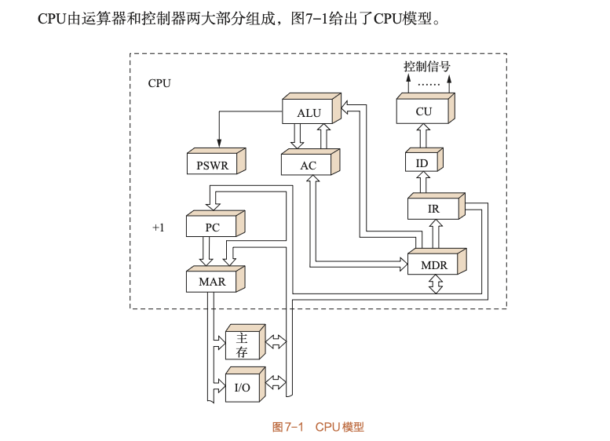

# 7.1 中央处理器概述

本章节介绍CPU的基本功能、组成结构、主要寄存器以及技术参数。

---

## 7.1.1 CPU的功能

从程序运行的角度看，CPU的基本功能是对 **指令流** 和 **数据流** 在 **时间** 与 **空间** 上实施正确的控制。

**五大具体功能：**

### 1. 指令控制

*   自动从存储器中取出指令。
*   控制指令的执行序列（如顺序执行、跳转等）。

### 2. 操作控制

*   分析指令，产生完成指令所需的控制信号。
*   协调并控制计算机各部件执行指令的操作。

### 3. 时序控制

*   对各种操作加以时间上的控制（确保按步骤进行）。

### 4. 数据加工

*   对数据进行算术运算、逻辑运算或逻辑测试。

### 5. 中断处理

*   处理计算机运行过程中出现的异常情况和特殊要求。

---

## 7.1.2 CPU的组成与主要寄存器

### 1. 硬件组成

**CPU = 控制器 + 运算器**

#### 控制器 (Controller) 的主要功能

*   **取指**：从主存取出指令，指出下条指令位置。
*   **译码**：对指令进行译码或测试，产生操作控制信号。
*   **指挥**：控制CPU、主存、I/O设备间的数据流动。

#### 运算器 (ALU) 的主要功能

*   执行所有算术运算。
*   执行所有逻辑运算及测试。

---

### 2. 关键部件缩写与全称

| 缩写 | 全称 | 中文名称 | 主要功能 |
|:----:|:----:|:--------:|:--------:|
| **CU** | Control Unit | 控制单元 | 产生控制信号，协调各部件工作 |
| **ALU** | Arithmetic Logic Unit | 算术逻辑单元 | 执行算术和逻辑运算 |
| **PC** | Program Counter | 程序计数器 | 存放当前指令地址，自动加1 |
| **IR** | Instruction Register | 指令寄存器 | 存放当前正在执行的指令 |
| **ID** | Instruction Decoder | 指令译码器 | 对指令进行译码，产生控制信号 |
| **MAR** | Memory Address Register | 存储器地址寄存器 | 存放要访问的主存地址 |
| **MDR** | Memory Data Register | 存储器数据寄存器 | 存放从主存读/写的数据 |
| **AC** | Accumulator | 累加器 | 存放运算结果和操作数 |
| **PSWR** | Program Status Word Register | 程序状态字寄存器 | 存放程序运行状态（标志位） |

---

### 3. 寄存器分类

#### 按可见性分类

*   **对程序设计者可见**：
    *   通用寄存器（如PC, PSWR, AC等部分）
    *   程序员可以直接访问和操作

*   **透明（不可见）**：
    *   专用寄存器（如MAR, MDR, IR等）
    *   主要用于CPU内部运作，对程序员透明

#### 按功能分类

*   **通用寄存器**：可用于存放操作数、地址等，用途较灵活
*   **专用寄存器**：专门用于特定功能，如PC、IR、MAR、MDR等

---

## 7.1.3 CPU的主要技术参数

### 1. 核心数量 (Core Count)

*   由于物理极限（主频和晶体管限制），**多核**成为主流。
*   一般来说物理核心越多性能越强，但受"功耗墙"限制。
*   多核处理器可以并行执行多个任务，提高整体性能。

---

### 2. 频率 (Frequency)

#### 主频（内频）

*   CPU内部工作频率，衡量速度的重要参数。
*   **注意**：主频不完全代表整体性能，还需考虑架构、缓存等因素。

#### 外频

*   主板为CPU提供的基准时钟频率。
*   早期CPU的内频等于外频。

#### 倍频

*   现代微机采用倍频技术，允许CPU以更高的频率工作。

#### 频率关系公式

$$\text{内频} = \text{外频} \times \text{倍频}$$

**示例**：
*   外频 = 100MHz，倍频 = 40
*   内频 = 100MHz × 40 = 4000MHz = 4GHz

---

### 3. 片内高速缓冲存储器 (Cache)

*   **目的**：解决 CPU 与 主存 之间速度差异巨大的问题。
*   **指标**：容量越大越好，现代CPU采用多级层次结构。
*   **层次结构**：
    *   **L1 Cache**：容量最小，速度最快，通常分为指令Cache和数据Cache
    *   **L2 Cache**：容量中等，速度较快
    *   **L3 Cache**：容量较大，速度较慢，多核共享

---

### 4. 电压与功耗 (Voltage & Power)

#### 电压趋势

*   电压越来越低（从5V → 3.3V → 1.8V → 更低）

#### 低电压的好处

*   **降低功耗**：适合移动计算设备，延长电池寿命
*   **减少发热**：降低温度，延缓芯片老化
*   **提高主频**：降低电压有利于提高主频从而提升性能（关键点）

#### 限制因素

*   电压不能无限低
*   较高的电压能带来更好的信号稳定性
*   需要在性能和稳定性之间找到平衡

---

### 5. 制造工艺 (Process Technology)

#### 定义

*   芯片内电路与电路之间的距离（线宽）。

#### 单位

*   微米($\mu m$) $\to$ 纳米($nm$)

#### 意义

*   线宽越小，芯片上集成的晶体管数目越多，性能越强。
*   更小的线宽意味着：
    *   更高的集成度
    *   更低的功耗
    *   更高的性能

#### 发展历程

$$0.35\mu m \to \dots \to 14nm \to 7nm \to 5nm \to \dots$$

**注意**：受物理条件限制（量子效应等），线宽不可能无限小。

---

## 总结

CPU作为计算机的核心部件，其功能可以概括为对指令流和数据流的控制。CPU由控制器和运算器组成，通过各类寄存器协同工作。现代CPU的技术参数（核心数、频率、Cache、电压、工艺）都在不断优化，以追求更高的性能和更低的功耗。

