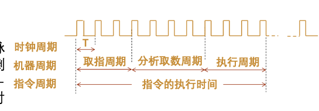
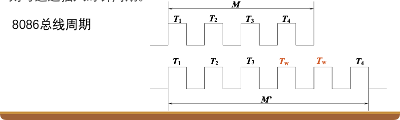

# 7.2 时序系统

时序系统是控制器的"心脏"，为指令执行提供各种定时信号。本章节介绍时序系统的基本概念、控制方式以及指令运行的基本过程。

---

## 7.2.1 基本概念

### 1. 三级时序周期体系

从大到小依次为：

#### 指令周期 (Instruction Cycle)

*   **定义**：取出并执行完一条指令所需的全部时间。
*   **特点**：不同指令的功能和复杂度不同，因此指令周期长度不尽相同。
*   **关系**：指令周期由多个机器周期组成。

#### 机器周期 (Machine Cycle)

*   **定义**：也称为**CPU周期**。指完成一个基本操作（如取指、存储器读写）所需的时间。
*   **关系**：
    $$\text{指令周期} = i \times \text{机器周期}$$
    其中 $i$ 为整数，表示一条指令需要多少个机器周期。

#### 时钟周期 (Clock Cycle)

*   **定义**：也称为**节拍**或**T周期**。是处理器的基准时间单位，主频的倒数。
*   **关系**：是计算机中最微小的操作时间单位。
*   **公式**：
    $$\text{时钟周期} = \frac{1}{\text{主频}}$$



---

### 2. 时钟周期的选取方案

#### 方案一：定长CPU周期

*   **原理**：以**最复杂**的机器周期为标准，所有机器周期长度一致。
*   **优点**：
    *   结构简单
    *   控制电路容易实现
*   **缺点**：
    *   时间浪费（简单操作也要等待最长时间）
    *   效率低

#### 方案二：不定长CPU周期

*   **原理**：根据实际需要，需要多少节拍就分配多少。
*   **优点**：
    *   时间利用率高
    *   无时间浪费
*   **缺点**：
    *   控制电路复杂
    *   实现难度大

#### 方案三：时钟周期插入法（如8086总线周期）

*   **原理**：前两者的折中方案。选取一个适中的基本时长，对于无法在基本时长内完成的操作（如慢速内存读写），插入等待周期（$T_w$）来延长。
*   **优点**：
    *   兼顾了简单性和效率
    *   适应不同速度的部件
*   **应用**：现代计算机中广泛采用



---

## 7.2.2 控制方式

### 1. 同步控制方式 (Synchronous)

*   **别称**：集中控制、中央控制
*   **原理**：所有操作均由统一的时序信号驱动
*   **特点**：
    *   设计简单，容易实现
    *   存在**时间浪费**（必须迁就最慢的部件）
    *   所有操作必须等待最慢的操作完成

**适用场景**：功能部件速度相近，或对实时性要求不高的系统。

---

### 2. 异步控制方式 (Asynchronous)

*   **别称**：分散控制、局部控制
*   **原理**：无统一时序，采用**应答（握手）**方式，根据部件的具体情况交互决定（如"读毕"信号）
*   **特点**：
    *   机器效率高，无时间浪费
    *   控制逻辑**复杂**
    *   需要额外的握手信号线

**工作流程**：
1. 请求方发出请求信号
2. 响应方完成操作后发出应答信号
3. 请求方收到应答后继续下一步

**适用场景**：功能部件速度差异大，需要充分利用各部件性能的系统。

---

### 3. 联合控制方式 (Joint)

*   **原理**：同步与异步相结合
*   **应用**：现代计算机大多数采用此方式
*   **设计思想**：
    *   **功能部件内部**：采用同步控制（简单高效）
    *   **功能部件之间**：采用异步控制（适应不同速度）

**优势**：
*   兼顾了简单性和效率
*   既保证了控制逻辑的简单性，又充分利用了各部件性能
*   是现代计算机的主流设计方式

---

## 7.2.3 指令运行的基本过程

一条指令的运行过程主要分为三个阶段：**取指令** $\to$ **分析取数** $\to$ **执行**。

### 1. 取指令阶段 (Fetch Stage) —— **公共操作**

**任务**：从主存取出当前指令送入指令寄存器(IR)，并让PC指向下一条指令。

**数据通路与微操作**（假设单总线结构）：

1.  $(PC) \to MAR$：将PC内容送至地址寄存器，并送地址总线。
2.  $Read$：CU向主存发读命令。
3.  $M[MAR] \to MDR$：存储器将数据送至数据寄存器。
4.  $(MDR) \to IR$：将MDR中的指令送至指令寄存器。
5.  $(PC) + 1 \to PC$：程序计数器加1，指向下一条指令。

**特点**：
*   上述操作对任何指令都是必须的，因此称为"公共操作"
*   所有指令都必须经过这个阶段

---

### 2. 分析取数阶段 (Decode & Operand Fetch)

**任务**：

*   **译码**：指令译码器(ID)识别指令类型，分析指令格式
*   **取数**：根据寻址方式计算有效地址，获取操作数

**特点**：
*   不同指令的操作各不相同
*   根据指令类型和寻址方式，可能需要：
    *   从寄存器取数
    *   从主存取数
    *   计算有效地址
    *   取立即数

**示例**：
*   寄存器寻址：直接从寄存器取数
*   直接寻址：从指令中获取地址，访问主存
*   间接寻址：先取地址，再根据地址取操作数

---

### 3. 执行阶段 (Execute Stage)

**任务**：完成指令规定的操作（运算、传送等），并将结果存储起来（写回寄存器或内存）。

**操作类型**：
*   **算术运算**：加、减、乘、除等
*   **逻辑运算**：与、或、非、异或等
*   **数据传送**：寄存器间传送、寄存器与主存间传送
*   **控制转移**：跳转、分支、调用等
*   **其他操作**：移位、比较、测试等

**结果处理**：
*   运算结果可能写入：
    *   通用寄存器（如累加器AC）
    *   主存单元
    *   程序状态字寄存器（PSWR，如标志位）

---

### 4. 循环流程

计算机的工作过程就是：

$$\text{取指令} \to \text{分析} \to \text{执行} \to \text{取下一条指令} \to \dots$$

如此周而复始，直到遇到：
*   **停机指令**：程序正常结束
*   **外部干预**：中断、异常等

**指令周期示意**：

```
┌─────────────┐
│  取指令阶段  │ ← 公共操作
└──────┬──────┘
       │
┌──────▼──────┐
│ 分析取数阶段 │ ← 指令相关
└──────┬──────┘
       │
┌──────▼──────┐
│   执行阶段   │ ← 指令相关
└──────┬──────┘
       │
       └──────→ 取下一条指令
```

---

---

## 💡 学习要点与重难点标注

### 三级时序系统（★重点）

**关系**：指令周期 > 机器周期 > 时钟周期

*   **指令周期**：执行一条指令的全部时间
*   **机器周期**：完成一个基本操作（如取指、访存）的时间
*   **时钟周期**（节拍）：最基本的时间单位，主频的倒数

### 时序选取方案对比

| 方案 | 原理 | 优点 | 缺点 |
|:----:|:----:|:----:|:----:|
| **定长CPU周期** | 以最复杂的周期为准 | 设计简单 | 浪费时间 |
| **不定长CPU周期** | 按需分配 | 效率高 | 控制复杂 |
| **时钟周期插入法** | 折中方案，不够就插等待周期 | 兼顾简单性和效率 | - |

### 控制方式

*   **同步控制**：统一时钟，设计简单但存在时间浪费
*   **异步控制**：握手信号，无时钟浪费但控制逻辑复杂
*   **联合控制**：现代主流，内部同步，外部异步

---

## 总结

时序系统为CPU提供了时间基准，通过三级时序周期（指令周期、机器周期、时钟周期）来协调各部件的工作。控制方式有同步、异步和联合三种，现代计算机多采用联合控制方式。指令执行的基本过程包括取指令、分析取数和执行三个阶段，其中取指令是公共操作，所有指令都必须执行。

