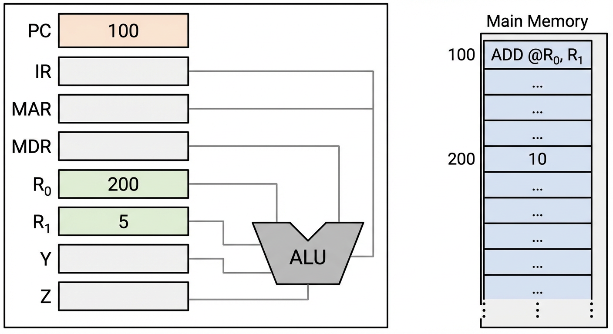
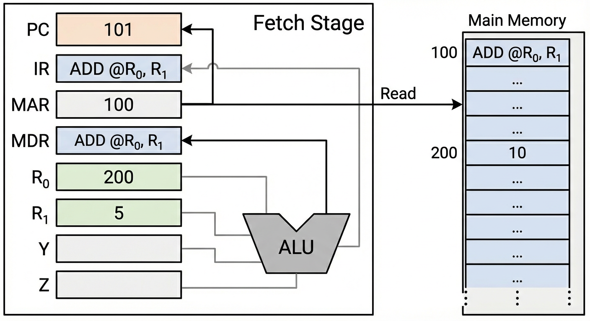
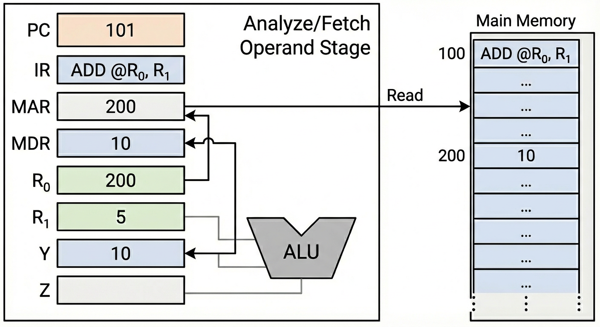
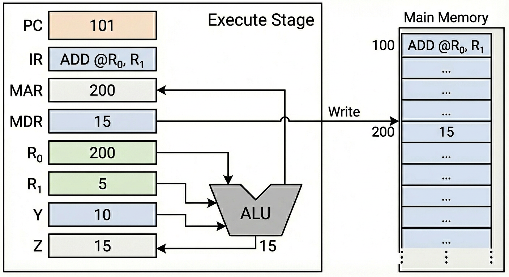

# 7.3 数据通路

数据通路指数据在CPU内部各功能部件之间传送的路径。理解数据通路对于掌握CPU的工作原理至关重要。

---

## 7.3.1 数据通路的基本概念

### 定义

**数据通路**：数据在CPU内部各功能部件（寄存器、ALU、主存接口等）之间传送的路径。

### 组成要素

*   **功能部件**：寄存器、ALU、主存接口等
*   **数据总线**：连接各功能部件的通路
*   **控制信号**：控制数据流动的方向和时机

---

## 7.3.2 数据通路结构及其设计

数据通路设计是CPU设计的核心环节，需要系统性地规划指令执行所需的功能部件及其连接方式。

### 数据通路设计的一般步骤

#### 1. 拟定指令系统

*   **确定指令格式**：指令长度、操作码位数、地址码位数等
*   **确定指令功能**：每条指令要完成的操作
*   **确定寻址方式**：如寄存器寻址、直接寻址、间接寻址等
*   **示例**：规整型指令、寄存器寻址方式

#### 2. 确定总体结构

*   **分析每条指令的执行流程**：确定指令执行需要经过哪些阶段
*   **确定功能部件**：分析每条指令信息流经的功能部件
    *   **寄存器**：PC（程序计数器）、IR（指令寄存器）、通用寄存器（如R₀, R₁, ...）
    *   **运算部件**：ALU（算术逻辑单元）
    *   **存储接口**：MAR（存储器地址寄存器）、MDR（存储器数据寄存器）
*   **确定连接方式**：单总线、多总线或其他连接方式

#### 3. 安排好工作时序

*   **拟定指令流程**：将指令执行划分为多个阶段（如取指、译码、执行、访存、写回）
*   **拟定微命令序列**：确定每个阶段需要哪些微操作控制信号
*   **时序控制**：确保各微操作在正确的时刻执行

#### 4. 形成控制逻辑实现

*   **选择控制方式**：
    *   **组合逻辑型（硬布线控制器）**：由组合逻辑电路直接产生控制信号
    *   **微程序控制型**：通过执行微程序产生控制信号
*   **实现控制逻辑**：根据指令的操作码和执行阶段，产生相应的微操作控制信号

### 设计考虑因素

*   **功能完整性**：数据通路必须能够支持所有指令的执行
*   **性能优化**：减少数据传送次数，提高执行效率
*   **成本控制**：在满足功能的前提下，尽量简化硬件结构
*   **可扩展性**：便于后续添加新指令或功能

---

## 7.3.3 数据通路实例分析

### 指令：ADD @R₀, R₁

**指令功能**：$M[(R_0)] + (R_1) \to M[(R_0)]$

即：以R₀寄存器的内容为地址，从主存取出被加数，与R₁寄存器的内容（加数）相加，结果存回原主存地址。

:::details 间接寻址说明

**`@R₀` 表示间接寻址（Indirect Addressing）**：

*   **符号 `@`**：在指令中表示间接寻址，表示"以...为地址"
*   **间接寻址的含义**：
    *   R₀寄存器中存放的不是操作数本身，而是**操作数的地址**
    *   需要先访问R₀获取地址，再根据该地址访问主存获取实际的操作数
    *   这是一个**两次访存**的过程

**寻址方式对比**：

<AddressingComparison />

| 寻址方式 | 表示方法 | 操作数获取 | 访存次数 |
|:--------:|:--------:|:----------:|:--------:|
| **寄存器寻址** | `R₁` | 直接从寄存器R₁读取 | 0次 |
| **间接寻址** | `@R₀` | 先读R₀得地址，再根据地址读主存 | 1次（读主存） |
| **直接寻址** | `[地址]` | 直接根据指令中的地址读主存 | 1次（读主存） |

**间接寻址的执行过程**：

1.  **第一步**：读取R₀寄存器的内容，得到操作数的地址（例如：100H）
2.  **第二步**：以该地址访问主存，读取实际的操作数（例如：50H）

**为什么使用间接寻址？**

*   **灵活性**：可以通过修改R₀的值来访问不同的内存位置，而不需要修改指令
*   **指针功能**：R₀相当于一个指针，指向主存中的操作数
*   **动态寻址**：程序运行时可以动态改变R₀的值，实现动态数据访问

**在本指令中的体现**：

*   `@R₀`：表示被加数在主存中，地址存放在R₀中
*   `R₁`：表示加数直接存放在寄存器R₁中（寄存器寻址）
*   因此，执行时需要先从主存读取被加数（间接寻址），再与R₁中的加数相加

:::

**执行过程**：



:::tip 交互式微操作仿真

点击下面的组件，通过"下一步"按钮逐步查看 `ADD @R₀, R₁` 指令的12个微操作步骤，理解数据在CPU各部件间的流动过程。

<InstructionSimulator />

:::

#### 1. 取指阶段（公共操作）

*   $(PC) \to MAR$：程序计数器的内容送至存储器地址寄存器
*   $Read$：主存读命令
*   $M[MAR] \to MDR$：主存将指令送至存储器数据寄存器
*   $(MDR) \to IR$：MDR的内容送至指令寄存器
*   $(PC) + 1 \to PC$：程序计数器加1，指向下一条指令

:::details 为什么不是从 MAR 读取，而是从主存读取？

这是一个非常棒的问题！这说明你正在非常仔细地思考数据在总线上的流动过程。

答案是：**不是从 MAR 读取，而是根据 MAR 中的地址，从"主存（Memory）"读取。**

这很容易混淆，我用一个生动的比喻来解释 **MAR**、**MDR** 和 **主存** 之间的关系，你就瞬间明白了。

### 1. 快递柜的比喻

想象你去丰巢快递柜取快递：

*   **主存 (Memory)**：是整个**快递柜**（里面放着成千上万个包裹）。

*   **MAR (存储器地址寄存器)**：是你手里的**取件码**（比如 `1010`）。

*   **MDR (存储器数据寄存器)**：是你用来装快递的**手提袋**。

*   **指令/数据**：是柜子里的**包裹**。

**流程是这样的：**

1.  你把取件码 `1010` 输入系统（**PC -> MAR**）。

2.  快递柜系统根据这个码，弹开了第 1010 号柜门（**MAR -> 选中主存单元**）。

3.  你从柜子里把包裹拿出来，放进你的手提袋里（**主存 -> MDR**）。

4.  最后你把手提袋里的包裹拿回家拆开（**MDR -> IR**）。

**回到你的问题：**

如果你说"从 MAR 读取二进制代码"，就等于说"**从取件码里把包裹拿出来**"。

这显然是不可能的，取件码（MAR）只是一串数字，它告诉你在哪里，但它里面没有包裹（指令）。包裹在柜子（主存）里。

### 2. 硬件连线角度（更专业的解释）

在计算机的硬件连接中，这两者连接的总线是分开的：

*   **MAR** 连接的是 **地址总线 (Address Bus)**。它只能对主存喊："我要找第 5 号房间！"

*   **MDR** 连接的是 **数据总线 (Data Bus)**。它是用来接收主存回应的："第 5 号房间里的东西在这里，接好！"

**数据流向图：**

```text
       (告诉我地址)             (给我数据)

PC -----------------> MAR -----------------> 主存 (Memory)

                       |                      |

                       | (地址线)              | (数据线)

                       v                      v

                   选通存储单元  ---------->  MDR

                                              |

                                              v

                                             IR (指令寄存器)
```

**总结：**

*   **MAR** 提供的是 **"在哪里"** (Address)。

*   **MDR** 接收的是 **"是什么"** (Data/Instruction)。

*   MDR 里的东西（指令二进制代码）是**从主存流过来的**，而不是从 MAR 流过来的。 MAR 只是起了个"指路"的作用。

:::



#### 2. 分析取数阶段（获取被加数）

*   $(R_0) \to MAR$：R₀内容作为地址送至MAR
*   $Read$：主存读命令
*   $M[MAR] \to MDR$：从主存读取被加数至MDR
*   $(MDR) \to Y$：被加数暂存到寄存器Y



#### 3. 执行阶段

*   $(R_1) + (Y) \to Z$：ALU执行加法，R₁与Y相加，结果暂存到寄存器Z
*   $(Z) \to MDR$：结果送MDR，准备写回主存
*   $(R_0) \to MAR$：再次将地址送MAR
*   $Write$：主存写命令，将MDR的内容写入$M[MAR]$指定的单元



---

### 指令：ADD (R₁), (R₂)+

**指令功能**：$M[(R_1)] + M[(R_2)] \to M[(R_2)]$，然后 $(R_2) + 1 \to R_2$

即：将R₁指向的内存地址的值（被加数），加上R₂指向的内存地址的值（加数），结果存回R₂指向的地址，然后R₂自增1。

**指令特点**：
*   **两个操作数都在主存中**：需要两次访存读取操作数
*   **后自增寻址**：`(R₂)+` 表示先使用R₂的值作为地址，使用后再将R₂自增1
*   **结果写回主存**：运算结果需要写回R₂指向的内存单元

**执行过程**：

#### 1. 取指阶段（公共操作）

① $(PC) \to MAR$：程序计数器的内容送至存储器地址寄存器  
② $Read$：主存读命令  
③ $M[MAR] \to MDR \to IR$：主存将指令送至MDR，再送至指令寄存器  
④ $(PC) + 1 \to PC$：程序计数器加1，指向下一条指令

#### 2. 分析取数阶段（获取被加数）

⑤ $(R_1) \to MAR$：R₁内容作为地址送至MAR  
⑥ $Read$：主存读命令  
⑦ $M[MAR] \to MDR \to C$：从主存读取被加数至MDR，再送至暂存器C

#### 3. 分析取数阶段（获取加数）

⑧ $(R_2) \to MAR$：R₂内容作为地址送至MAR  
⑨ $Read$：主存读命令  
⑩ $M[MAR] \to MDR \to D$：从主存读取加数至MDR，再送至暂存器D

**取加数**：步骤⑧、⑨、⑩完成第二个操作数的获取。

#### 4. 修改目的地址

⑪ $(R_2) + 1 \to R_2$：R₂自增1，指向下一个地址单元

**修改目的地址**：步骤⑪实现后自增寻址，R₂的值在使用后自增。

#### 5. 执行阶段

⑫ $C + D \to MDR$：ALU执行加法，C（被加数）与D（加数）相加，结果送至MDR  
⑬ $Write$：主存写命令  
⑭ $MDR \to M[MAR]$：将MDR中的计算结果写入R₂指向的主存单元（注意：此时MAR中仍是R₂自增前的地址）

**完整微操作序列总结**：

| 阶段 | 微操作 | 说明 |
|:----:|:------:|:----:|
| **取指** | ① $(PC) \to MAR$ | 取指令地址 |
| | ② $Read$ | 发读命令 |
| | ③ $M[MAR] \to MDR \to IR$ | 指令进入IR |
| | ④ $(PC) + 1 \to PC$ | PC自增 |
| **取被加数** | ⑤ $(R_1) \to MAR$ | R₁内容送MAR |
| | ⑥ $Read$ | 发读命令 |
| | ⑦ $M[MAR] \to MDR \to C$ | 被加数暂存C |
| **取加数** | ⑧ $(R_2) \to MAR$ | R₂内容送MAR |
| | ⑨ $Read$ | 发读命令 |
| | ⑩ $M[MAR] \to MDR \to D$ | 加数暂存D |
| **修改地址** | ⑪ $(R_2) + 1 \to R_2$ | R₂自增1 |
| **执行** | ⑫ $C + D \to MDR$ | ALU加法运算 |
| | ⑬ $Write$ | 发写命令 |
| | ⑭ $MDR \to M[MAR]$ | 结果写回主存 |

**关键点**：
*   本指令共需要**3次访存**：1次取指令 + 2次取操作数 + 1次写结果
*   **后自增寻址**：R₂的值先作为地址使用，使用后再自增
*   **暂存器C和D**：用于暂存两个操作数，供ALU运算使用
*   **写回地址**：写回时使用的是R₂自增前的地址（因为步骤⑧已将地址送入MAR）

---

## 7.3.4 数据通路设计要点

### 1. 单总线结构

*   **特点**：所有部件共享一条数据总线
*   **优点**：结构简单，成本低
*   **缺点**：同一时刻只能有一个数据传送，效率较低

<BusLogicBox />

### 2. 多总线结构

*   **特点**：多条数据总线，可并行传送数据
*   **优点**：效率高，性能好
*   **缺点**：结构复杂，成本高

### 3. 数据通路设计原则

*   **功能完整性**：能够支持所有指令的执行
*   **效率优化**：尽量减少数据传送次数
*   **控制简化**：便于控制信号的生成

---

---

## 💡 学习要点与重难点标注

### 典型指令的数据流（★需会画图或描述）

#### 取指阶段（公共操作）

所有指令都必须执行的操作序列：

1.  `PC -> MAR`
2.  `Read` (控制总线)
3.  `M(MAR) -> MDR`
4.  `MDR -> IR`
5.  `PC + 1 -> PC`

#### ADD指令执行阶段示例

`R1 + Y -> Z -> MDR` (通过ALU运算，暂存到Z，再写入)

> **老师的意思**：这里要掌握的是**微操作（Micro-operation）**。每一个箭头代表一个微操作，这是后续设计控制器的基础。

### 为什么讲"数据通路"那么细？

> **老师未明说的"潜台词"**：
> 
> 这是考题的题干。考试可能会给你一个数据通路图（ALU、寄存器怎么连的），让你写出某条指令（如 `ADD R1, (R2)`）具体的执行步骤（微操作序列）。如果不懂通路，后面的控制器设计就没法做。

---

## 总结

数据通路是CPU内部数据流动的路径，理解数据通路有助于分析指令的执行过程。通过分析具体指令（如ADD @R₀, R₁）在数据通路上的信息流，可以深入理解CPU的工作原理。

