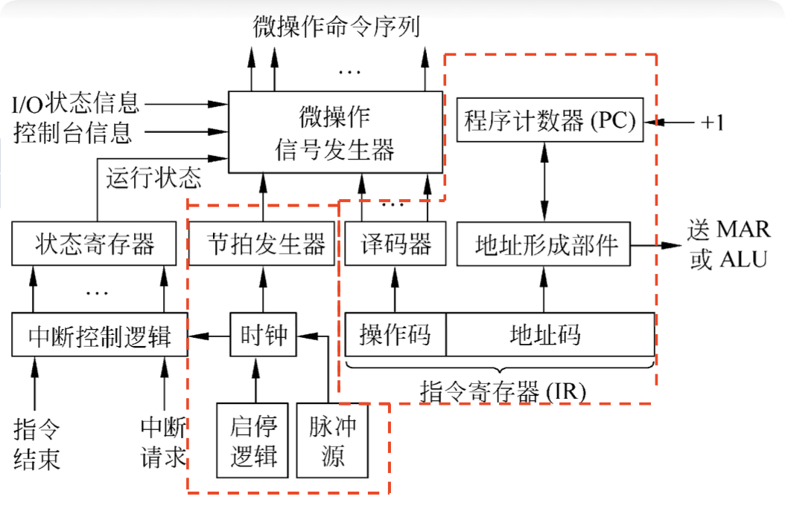

# 7.4 控制器原理与实现方法

控制器根据指令的要求指挥全机工作。其核心是微操作信号发生器，用于产生各种控制信号。

---

## 7.4.1 控制器的基本组成

---

## 7.4.2 控制器硬件实现方法（★简答题重点）

### 硬布线控制器 vs 微程序控制器

| 维度 | **硬布线控制器 (组合逻辑)** | **微程序控制器 (存储逻辑)** |
|:----:|:---------------------------:|:---------------------------:|
| **原理** | 纯硬件门电路实现 | 将控制信号编码为微指令存入ROM |
| **速度** | **快** (无访存延迟) | 慢 (需从CM读取微指令) |
| **灵活性** | 差 (修改需重新设计电路) | **好** (修改只需改微程序) |
| **适用** | RISC (精简指令集) | CISC (复杂指令集) |

### PLA控制器

*   **原理**：组合逻辑与存储逻辑的结合
*   **特点**：折中方案，兼顾两者优点（了解即可，不深究）

---

## 7.4.3 处理器架构演进（理解重点）

### 一、单周期 CPU

**特点**：
*   一条指令在一个长时钟周期内完成 (**CPI = 1**)
*   硬件部件**不能复用**（必须有独立的指令存储器和数据存储器）

**致命伤**：
*   时钟周期取决于**最慢**的那条指令（如Load指令）
*   执行快指令（如Add）时大量时间浪费（木桶效应）
*   效率低，硬件成本高

### 二、多周期 CPU

**特点**：
*   将指令切分为若干个短状态（IF, ID, EX, MEM, WB）
*   允许**硬件复用**（ALU既能算地址也能算数据）
*   时钟频率可以提得更高（时钟周期由基本操作决定，而非最复杂指令）

**意义**：它是**流水线技术**的前身

### 三、五阶段划分（★必须背，为7.6流水线打基础）

无论多周期还是流水线，标准的一条指令通常分为这5步：

1.  **IF (Instruction Fetch)**：取指阶段 - 取指令并更新PC
2.  **ID (Instruction Decode)**：译码阶段 - 指令译码，读寄存器
3.  **EX (Execute)**：执行阶段 - ALU运算或计算地址
4.  **MEM (Memory Access)**：访存阶段 - 读写存储器（如果需要）
5.  **WB (Write Back)**：写回阶段 - 结果写回寄存器（如果需要）

**示例**：
*   `Lw`需要5个周期（IF, ID, EX, MEM, WB）
*   `Add`只需要4个周期（IF, ID, EX, WB，跳过MEM）

---

## 💡 学习要点与重难点标注

### 控制器实现方式对比（★常考简答）

| 实现方式 | 原理 | 优点 | 缺点 | 应用 |
|:--------:|:----:|:----:|:----:|:----:|
| **组合逻辑型（硬布线）** | 用门电路实现 | 速度快 | 结构不规整，难修改 | RISC常用 |
| **存储逻辑型（微程序）** | 用ROM存微指令 | 规整、易修改（兼容性好） | 速度慢 | CISC常用 |
| **PLA型** | 折中 | 兼顾两者优点 | - | - |

### 处理器架构演进路线（★选择题/理解重点）

> **老师未明说的"潜台词"**：
> 
> 这是一条演进路线。单周期太慢（受限于最长指令）；多周期复用硬件；流水线提高吞吐率。复习时要对比它们的优缺点。

**对比表**：

| 类型 | CPI | 时钟周期 | 硬件复用 | 效率 |
|:----:|:---:|:--------:|:--------:|:----:|
| **单周期** | 1 | 由最长指令决定 | 不允许 | 低 |
| **多周期** | >1 | 由基本操作决定 | 允许 | 中 |
| **流水线** | ≈1 | 由最慢段决定 | 允许 | 高 |

---

## 总结

**核心考点**：

1. **硬布线 vs 微程序**：硬布线=快但难改（RISC），微程序=慢但易改（CISC）
2. **处理器演进**：单周期（CPI=1但效率低）→ 多周期（硬件复用）→ 流水线（重叠执行）
3. **五阶段划分**：IF → ID → EX → MEM → WB（必须背熟，为流水线打基础）

**复习建议**：这一章把精力主要放在**对比表**上，其他的只要知道"单周期太慢，多周期切分了状态"这个概念即可。**省下时间去攻克 7.5 的微程序编码计算和 7.6 的流水线大题！**
