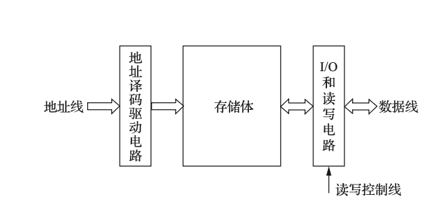

# 5.1 主存储器的组织

本节介绍主存储器的基本构成、核心概念和关键技术指标，是理解整个存储系统的基础。

## 核心概念

### 1. 主存储器的基本结构

主存储器（主存）由以下几个部分组成：

*   **存储体 (Memory Body)**：由大量的存储单元（或称存储元，Memory Cell）构成，是实际存储数据的地方。

*   **地址译码驱动电路**：将CPU送来的地址信号翻译成对应存储单元的选择信号，并提供足够的驱动电流。

*   **I/O和读写电路**：包括读出放大器、写入电路和读写控制逻辑，用于完成数据的读出和写入操作。

*   **控制线路**：接收来自CPU的读/写命令，控制整个存储器协调工作。

### 2. 基本术语

*   **存储单元**：存放一个**存储字**的存储空间，是CPU可访问的最小单位。每个存储单元都有一个唯一的**地址**。

*   **存储字 (Storage Word)**：一个存储单元中存放的二进制数据，其位数称为**存储字长**。

*   **存储容量**：主存能存放的二进制信息总量。计算公式为：

    $$
    \text{存储容量} = \text{存储单元个数} \times \text{存储字长}
    $$

    *   例如：一个 64K × 16 位的主存，表示它有 $2^{16}$ (65536) 个存储单元，每个单元存放16位数据。其容量若按字节表示为 128KB。

### 3. 主存分类

*   **按存取方式**：

    *   **随机存取存储器 (RAM - Random Access Memory)**：可以对任意单元进行读写，且存取时间与单元的物理位置无关。通常是**易失性**的（断电丢失数据），如SRAM和DRAM。

    *   **只读存储器 (ROM - Read-Only Memory)**：内容只能被读取不能被写入（或写入很困难）。通常是**非易失性**的（断电不丢数据）。

## 主要技术指标

### 1. 存储容量 (Capacity)

如上所述，通常用 KB, MB, GB, TB 等单位表示。注意区分 K、M 等单位在计算机领域的含义（$2^{10}, 2^{20}$）。

### 2. 存取速度 (Access Speed)

*   **存取时间 ($T_a$)**：又称访问时间，指从启动一次存储器操作到完成该操作所经历的时间。

*   **存取周期 ($T_m$)**：又称读写周期，指存储器能连续两次独立完成读或写操作所需的最小时间间隔。

    *   通常情况下，$T_m > T_a$，因为存储器在读写后需要一段恢复时间。

*   **主存带宽 ($B_m$)**：又称数据传输率，表示单位时间内从主存进出信息的最大数量，单位通常是 B/s (字节每秒)。

    $$
    B_m = \frac{1}{T_m} \times \text{存储字长 (位)} \div 8 \quad (\text{单位: B/s})
    $$

> **易考点**：
> *   **存储容量的计算**：给出售单元个数和字长，计算总容量（按位或按字节）。
> *   **存取时间和存取周期的区别**：存取周期总是大于或等于存取时间，对于破坏性读出的存储器更是如此。
> *   **主存带宽的计算**：这是衡量存储器性能的关键指标，务必掌握其计算公式。

