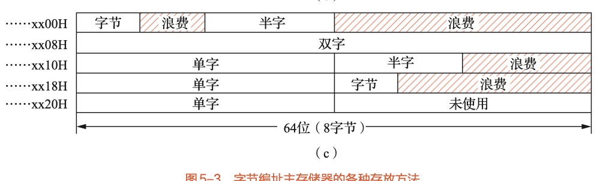

# 5.2 数据的宽度与存储

本节讨论数据在计算机中如何表示（宽度）以及如何存放在主存中（对齐和字节序），这是理解底层数据操作的关键。

## 核心概念

### 1. 数据的宽度

*   **字 (Word)**：被处理信息的单位。

*   **字长 (Word Length)**：数据运算的宽度，反映了计算机处理信息的能力。

*   两者长度可以相同也可以不同。例如，在Intel 80x86中，一个"字"定义为16位，而32位数据被称为"双字"。

### 2. 数据的排列顺序 (字节序 Endianness)

当一个多字节数据（如一个32位整数）存放在连续的字节地址中时，其各个字节的排列顺序存在两种方案：

*   **大端方案 (Big-Endian)**：

    *   **规则**：数据的**高位字节 (MSB)** 存放在**低地址**单元，**低位字节 (LSB)** 存放在**高地址**单元。

    *   **特点**：符合人类的阅读习惯。

    *   **代表架构**：IBM 370, PowerPC, Motorola 68k。

*   **小端方案 (Little-Endian)**：

    *   **规则**：数据的**高位字节 (MSB)** 存放在**高地址**单元，**低位字节 (LSB)** 存放在**低地址**单元。

    *   **特点**：便于计算机进行数值运算。

    *   **代表架构**：Intel x86系列。

**示例**：将32位整数 `0x12345678` 存放到从地址 `0x4000` 开始的内存中：

| 地址 | 大端方案 | 小端方案 |
| :---: | :---: | :---: |
| `0x4000` | `12` (MSB) | `78` (LSB) |
| `0x4001` | `34` | `56` |
| `0x4002` | `56` | `34` |
| `0x4003` | `78` (LSB) | `12` (MSB) |

### 3. 数据在主存中的存放 (边界对齐 Alignment)

为了提高存取效率，多字节的数据在存放时通常要求**地址对齐**。

*   **不对齐存放**：数据紧密排列，不浪费空间。但访问一个跨越存储字边界的数据可能需要两次访存，导致性能下降且控制复杂。

*   **边界对齐存放**：

    *   **规则**：规定不同长度的数据必须存放在其**地址是其长度整数倍**的位置。

        *   **双字 (8字节)**：起始地址的最末3位二进制为 `000`。（例如 `xx00H`、`xx08H`）

        *   **单字 (4字节)**：起始地址的最末2位二进制为 `00`。（例如 `xx00H`、`xx04H`）

        *   **半字 (2字节)**：起始地址的最末1位二进制为 `0` (偶数地址)。（例如 `xx00H`、`xx02H`）

    *   **优点**：保证任何数据都可以在一个存取周期内完成读写，控制简单，速度快。

    *   **缺点**：可能会浪费部分存储空间。

> **易考点与难点**：
> *   **大小端判断**：这是非常经典的考点（参考习题5-3），要求能准确画出数据在两种字节序下的内存布局。
> *   **边界对齐**：这是一个难点（参考习题5-4），核心是理解"空间换时间"的思想。考试中可能要求根据对齐规则，安排一组不同长度的数据在内存中的存放位置，并计算空间利用率。

