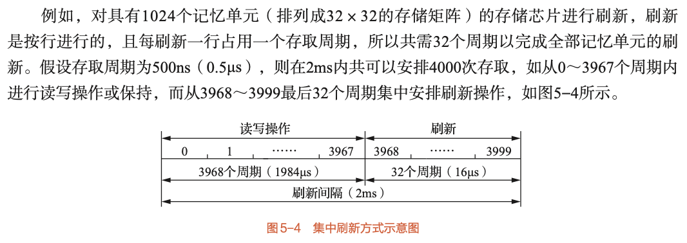
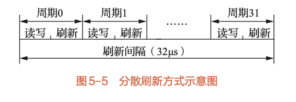
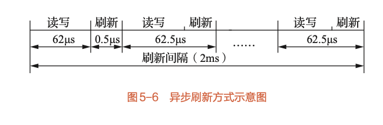
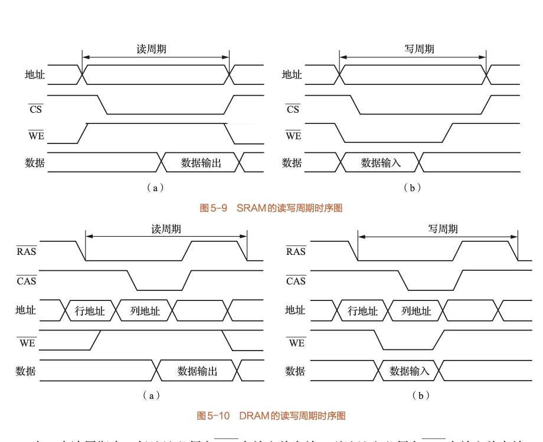

# 5.3 半导体随机存储器和只读存储器

本节深入探讨构成主存的两种核心芯片：RAM和ROM。重点是SRAM和DRAM的本质区别、DRAM独特的刷新机制、RAM芯片的内部结构与外部引脚，以及ROM和Flash存储器的分类与特点。

## 5.3.1 RAM的记忆单元

*   **记忆单元**：存储一个二进制位（0或1）的物理器件，是存储器的最基本构件。

*   **存储单元**：由地址码相同的多个记忆单元构成，用于存放一个存储字。

*   **易失性 (Volatility)**：半导体RAM的共同特点，一旦断电，存储的信息就会丢失。

### 1. 静态RAM (SRAM - Static RAM)

*   **存储原理**：使用**双稳态触发器**（由6个晶体管构成）来存储一位信息。只要有电，触发器就维持在一个稳定状态（0或1），信息不会丢失。

*   **特点**：

    *   **优点**：存取速度极快，读写时无需刷新，控制简单。

    *   **缺点**：单个记忆单元晶体管数量多，导致**集成度低**、**功耗大**、**成本高**。

*   **主要用途**：制造高速缓冲存储器 (Cache) 和小容量主存系统。

### 2. 动态RAM (DRAM - Dynamic RAM)

*   **存储原理**：利用**栅极电容**上存储的电荷来表示信息。电容上有电荷代表1，无电荷代表0。

*   **特点**：

    *   **优点**：结构简单（一个晶体管和一个电容），**集成度极高**，**功耗低**，**成本低廉**。

    *   **缺点**：

        1.  **需要周期性刷新**：电容上的电荷会随时间自然泄漏，必须在信息丢失前周期性地对其补充电荷，这个过程称为**刷新 (Refresh)**。

        2.  **破坏性读出**：读取DRAM单元信息时，会释放电容电荷，导致原信息被破坏。因此，读操作后必须紧跟一个**重写 (Rewrite)** 操作来恢复信息。

        3.  **速度较慢**：相比SRAM，存取过程更复杂，速度较慢。

*   **主要用途**：制造大容量的主存储器。

### SRAM与DRAM对比表

| 特性 | 静态RAM (SRAM) | 动态RAM (DRAM) |
| :--- | :--- | :--- |
| **存储元件** | 双稳态触发器 | 栅极电容 |
| **是否刷新** | 不需要 | 需要周期性刷新 |
| **读出方式** | 非破坏性 | 破坏性（需重写） |
| **速度** | 快 | 慢 |
| **集成度** | 低 | 高 |
| **功耗** | 大 | 小 |
| **成本** | 高 | 低 |
| **主要用途** | 高速缓存 (Cache) | 大容量主存 |

## 5.3.2 动态RAM的刷新

刷新是DRAM工作的核心机制，也是本章的重点和难点。

### 1. 刷新与重写的区别

*   **重写 (Rewrite)**：**随机发生**，是**读操作的一部分**。当某个单元被破坏性读出后，立即对其进行重写。重写是针对**单个存储单元**的。

*   **刷新 (Refresh)**：**定时发生**，是**独立于读写**的操作。为补偿所有单元的电荷泄漏，周期性地对存储体进行刷新。刷新通常以**存储矩阵的一整行**为单位进行。

### 2. 刷新方式

最大刷新间隔通常为2ms或4ms，即所有行必须在此时间内至少被刷新一次。

#### (1) 集中刷新 (Concentrated Refresh)

*   **原理**：在一个固定的时间段内，暂停所有正常的读写操作，集中对存储器的所有行进行逐一刷新。这段暂停时间称为"**死区 (Dead Zone)**"或"死时间"。

*   **优点**：在非"死区"时间，读写操作不受刷新影响，存取速度快。

*   **缺点**：存在"死区"，在此期间CPU无法访问内存，对于需要实时响应的系统是致命的。存储容量越大，死区越长。

*   

#### (2) 分散刷新 (Distributed Refresh)

*   **原理**：将刷新操作分散到每个存取周期中。每个系统存取周期被延长，分为两部分：前半段用于正常读写，后半段用于刷新一行。

*   **优点**：没有"死区"，CPU可随时访存。

*   **缺点**：**加长了每个存取周期**，导致系统整体速度下降。且刷新过于频繁，未充分利用2ms的最大刷新间隔。

*   

#### (3) 异步刷新 (Asynchronous Refresh)

*   **原理**：集中式和分散式的折衷方案。在最大刷新间隔（如2ms）内，将所有行的刷新操作**平均分配**。

*   **计算公式**：

    $$
    \text{相邻两行刷新间隔} = \frac{\text{最大刷新间隔时间}}{\text{存储矩阵行数}}
    $$

*   **例如**：对于一个32×32矩阵（32行），最大刷新间隔为2ms，则每隔 $2ms / 32 = 62.5\mu s$ 就需要安排一次刷新操作。

*   **优点**：刷新"死区"变得极短（仅为一个刷新周期，如0.5μs），大大减少了CPU的等待时间，同时又避免了不必要的频繁刷新。这是**最常用、最实用**的方式。

*   

### 深入理解：异步刷新与分散刷新的本质区别

结合存取时间（$T_a$）和存取周期（$T_m$）来看，异步刷新和分散刷新对周期的影响存在本质差异：

*   **异步刷新：利用 $T_m$ 之间的间隙，不影响周期本身**

    存取周期 $T_m$ 是"连续两次独立读写的最小间隔"，而单次读写的实际操作时间（存取时间 $T_a$）通常小于 $T_m$（即 $T_a < T_m$）。这意味着两次读写之间存在一个微小的"空闲窗口"（$T_m - T_a$）。  

    异步刷新的刷新操作（仅需1-2个时钟周期）就被安排在这个 **$T_m$ 之间的空闲窗口** 内，既不占用单次读写的 $T_a$ 时间，也不会拉长 $T_m$ 的长度。因此，$T_m$ 保持不变，读写周期的完整性不受影响。

*   **分散刷新：将刷新时间插入 $T_m$ 内部，直接拉长周期**

    分散刷新的逻辑是"一次读写 + 一次刷新"绑定为一个新的周期。原本的 $T_m$ 仅包含读写操作，而分散刷新会把刷新时间（比如与 $T_a$ 等长）直接加入到 $T_m$ 中，导致新的周期变为：  

    **新 $T_m' = T_a$（读写） + $T_{\text{刷新}}$（刷新）**  

    显然 $T_m' > T_m$，即存取周期被拉长了。这就是为什么分散刷新会降低读写效率——它硬生生把每个周期的时间变长了。

**简单总结**：  

- 异步刷新：在"两个 $T_m$ 之间的空隙"偷偷完成刷新，$T_m$ 不变；  

- 分散刷新：在"单个 $T_m$ 内部"塞进去刷新时间，$T_m$ 被迫拉长。

## 5.3.3 RAM芯片分析

### 1. RAM芯片的外部引脚

*   **地址线 (A)**：单向输入，用于接收CPU发来的地址信号。地址线数量 $n$ 决定了芯片的容量（$2^n$个单元）。

*   **数据线 (D)**：双向，用于读出或写入数据。数据线数量 $m$ 就是芯片的字长（$m$位）。

*   **片选线 ($\overline{CE}$或$\overline{CS}$)**：低电平有效。只有当该引脚为低电平时，芯片才被选中，响应读写操作。

*   **读/写控制线**：

    *   通常用一根**写允许线 ($\overline{WE}$)**：$\overline{WE}=0$ 时写入，$\overline{WE}=1$ 时读出。

    *   也可用两根线：**读允许线($\overline{OE}$)** 和 **写允许线($\overline{WE}$)**。

*   **电源 (Vcc) 和接地 (GND)**。

### 2. DRAM的地址复用技术

DRAM为了减少引脚数量、降低封装成本，采用了**地址复用技术**。

*   **原理**：将地址线分为**行地址**和**列地址**两部分，分两次通过同一组地址引脚送入芯片。

*   **控制信号**：

    *   **行地址选通信号 ($\overline{RAS}$)**：当其有效（变为低电平）时，地址引脚上的信号被锁存为行地址。

    *   **列地址选通信号 ($\overline{CAS}$)**：当其有效时，地址引脚上的信号被锁存为列地址。

*   **效果**：地址线引脚数量可以减少一半。例如，一个64K×1位的DRAM需要16根地址线（$2^{16}=64K$），采用地址复用后，只需要8根地址引脚。

### 3. 地址译码方式

在上一部分我们讨论了RAM芯片的外部引脚，现在我们深入其内部，探讨芯片是如何将输入的地址信号转换为对具体某个或某些记忆单元的选择的。这个过程由内部的**地址译码电路**完成。

#### (1) 单译码方式 (字选法)

*   **核心原理**：将 L 位的地址线（例如 A0-A4，L=5）作为一个整体，送入一个地址译码器。该译码器有 $2^L$ 个输出，每个输出对应一条**字选择线 (Word Line)**。当某条字选择线被激活时，它会选中存储矩阵中的一整行，这一整行就构成一个**存储字**。

*   **结构**：存储体被组织成一个 $N \times b$ 的矩阵，其中 $N=2^L$ 是存储字的数量，b是每个存储字的位数（字长）。共有 N 条字选择线和 b 条**位线 (Bit Line)**。

*   **优点**：

    *   逻辑结构简单直观。

*   **缺点**：

    *   **译码器规模巨大**：当地址线 L 增加时，译码器的输出线数量 ($2^L$) 会呈指数级增长。例如，一个64K ($2^{16}$) 单元的存储器，需要一个16-65536译码器，这在物理上难以实现。

    *   **驱动器数量庞大**：每条字选择线都需要一个驱动器，导致成本高、功耗大。

    *   **物理形状不合理**：对于大容量存储器，这种结构会形成一个纵向很长而横向很窄的矩阵，不利于芯片的布局和布线。

*   **适用场景**：仅适用于容量非常小的存储器。

#### (2) 双译码方式 (重合法)

为了克服单译码方式的缺点，现代大容量RAM芯片普遍采用双译码方式。

*   **核心原理**：将 L 位的地址线**分割**成两部分：**X地址（行地址）**和**Y地址（列地址）**。这两部分地址分别送入两个独立的译码器：**行地址译码器**和**列地址译码器**。

    *   行地址译码器选择存储矩阵中的**一行**。

    *   列地址译码器选择存储矩阵中的**一列**（或一组列）。

    *   位于被选中的行和列交叉点的**记忆单元**即为最终被选中的单元。这个过程称为**重合法 (Coincidence)**。

*   **结构**：存储体被组织成一个尽可能接近**方阵**的二维矩阵，这在物理上非常高效。

*   **优点**：

    *   **大幅减少选择线和驱动器数量**：假设 L 位地址均分为两部分，每部分 L/2 位。选择线总数从 $2^L$ 条锐减到 $2^{L/2} + 2^{L/2} = 2 \times 2^{L/2}$ 条。这极大地降低了成本和功耗，使得制造大容量芯片成为可能。

    *   **芯片物理结构合理**：方阵结构非常适合在硅片上进行布局。

#### 示例与对比

我们以一个容量为 64K ($2^{16}$) 的存储单元为例，对比两种译码方式的差异：

| 译码方式 | 占用地址位 | 选择线数 (等于驱动器数) |
| :--- | :--- | :--- |
| **单译码** | 16 | $2^{16}$ = **65,536** |
| **双译码** | 8 (行地址) + 8 (列地址) | $2^8 + 2^8 = 256 + 256 = \textbf{512}$ |

从表中可以清晰地看到，双译码方式将选择线和驱动器的数量从六万多条减少到了五百多条，优势是压倒性的。

> **与地址复用的关系**：DRAM的地址复用技术（分时送入行、列地址）正是建立在双译码的物理结构基础之上的。

### 4. RAM的读写周期时序

读写周期时序（Timing Diagram）是描述存储芯片在执行读或写操作时，其各个引脚信号（地址、数据、控制信号）电平状态随时间变化的图示。正确理解时序是确保CPU/内存控制器与存储芯片协同工作的关键。

#### (1) SRAM读写周期时序

SRAM的时序相对简单直接，因为其内部是静态触发器，无需刷新和复杂的地址锁存。

*   **SRAM读周期 (Read Cycle)**

    读操作是从芯片中取出数据的过程。其时序关键步骤如下：

    1.  **地址有效**：CPU首先将要读取的单元地址送到地址总线 (Address Bus) 上，并必须保持稳定一段时间。

    2.  **片选有效**：片选信号 $\overline{CS}$ (Chip Select) 变为低电平，选中该SRAM芯片。

    3.  **确定读操作**：写使能信号 $\overline{WE}$ (Write Enable) 必须保持为高电平（无效状态），表明这是一个读操作。

    4.  **数据输出**：经过一段内部译码和数据读取的延迟后（这段时间称为**存取时间 $t_{ACC}$**），存储器将指定单元的数据输出到数据总线 (Data Bus) 上。

    5.  **操作结束**：CPU从数据总线上读取数据后，可以将 $\overline{CS}$ 信号置为高电平，结束本次读周期。此时，数据线恢复为高阻态。

    **总结**：`地址稳定 -> CS有效 -> WE为高 -> 等待t_ACC -> 数据有效`

*   **SRAM写周期 (Write Cycle)**

    写操作是将CPU的数据存入芯片的过程。其时序关键步骤如下：

    1.  **地址有效**：CPU将要写入的单元地址送到地址总线上，并保持稳定。

    2.  **数据有效**：CPU将要写入的数据送到数据总线上，并保持稳定。

    3.  **片选有效**：片选信号 $\overline{CS}$ 变为低电平，选中该芯片。

    4.  **执行写操作**：写使能信号 $\overline{WE}$ 产生一个**负脉冲**（由高变低再变高）。在 $\overline{WE}$ 为低电平的这段时间内，数据总线上的数据被写入到地址线指定的存储单元中。

    5.  **操作结束**：写操作完成后，$\overline{CS}$ 信号恢复为高电平。

    **总结**：`地址稳定 -> 数据稳定 -> CS有效 -> WE变低执行写入 -> WE变高 -> CS无效`

    > **关键点**：在整个写周期中，地址信号和数据信号都必须在 $\overline{WE}$ 信号变为低电平**之前**稳定，并在其恢复为高电平**之后**才能改变，以确保数据的正确写入。

#### (2) DRAM读写周期时序

DRAM的时序要复杂得多，主要是因为它采用了**地址复用技术**，需要分两次送入地址，并由 $\overline{RAS}$ 和 $\overline{CAS}$ 信号配合锁存。

*   **DRAM读周期 (Read Cycle)**

    1.  **送入行地址**：CPU将16位地址中的高8位（行地址）送到DRAM的8个地址引脚上。

    2.  **$\overline{RAS}$ 锁存**：**行地址选通信号 ($\overline{RAS}$)** 变为低电平。DRAM芯片在$\overline{RAS}$的下降沿将地址引脚上的信号锁存为**行地址**。同时，这一步会激活对应的一整行，将其数据读入到行内的**行缓冲器/感应放大器**中（这是破坏性读出）。

    3.  **送入列地址**：CPU将16位地址中的低8位（列地址）送到**相同的8个**地址引脚上。

    4.  **$\overline{CAS}$ 锁存**：**列地址选通信号 ($\overline{CAS}$)** 变为低电平。DRAM芯片在$\overline{CAS}$的下降沿将地址引脚上的信号锁存为**列地址**。

    5.  **确定读操作**：写使能信号 $\overline{WE}$ 在此期间保持高电平。

    6.  **数据输出**：$\overline{CAS}$ 信号有效后，行缓冲器中由列地址指定的数据被选中，并经过输出缓冲器送到数据总线上。从 $\overline{RAS}$ 信号有效到数据有效的时间，称为**RAS存取时间 ($t_{RAC}$)**。

    7.  **预充电**：读周期结束后，$\overline{RAS}$ 返回高电平，DRAM内部进行**预充电**，为下一次操作做准备。从一次操作开始到下一次操作可以开始的最小时间，称为**读写周期时间 ($t_{Cycle}$)**。

*   **DRAM写周期 (Write Cycle)**

    写周期的地址选择过程与读周期完全相同。

    1.  **送入并锁存地址**：依次送入行地址和列地址，并分别由 $\overline{RAS}$ 和 $\overline{CAS}$ 的下降沿锁存。

    2.  **送入数据**：CPU将要写入的数据放到数据总线上。

    3.  **执行写操作**：写使能信号 $\overline{WE}$ 必须在 $\overline{CAS}$ 变为低电平**之前或同时**变为低电平。当 $\overline{RAS}$、$\overline{CAS}$、$\overline{WE}$ 均处于低电平时，数据总线上的数据被写入到由行、列地址选中的行缓冲器单元中。

    4.  **写回与预充电**：当 $\overline{RAS}$ 返回高电平时，行缓冲器中被修改后的整行数据被**写回到**原始的存储电容阵列中（完成**重写**），同时进行预充电。

> **时序要点**：
> *   **核心区别**：SRAM时序是**一次性地址**，控制简单；DRAM时序是**分时复用地址**，需要 $\overline{RAS}$ 和 $\overline{CAS}$ 配合，时序复杂。
> *   **信号的先后顺序**：理解信号的依赖关系至关重要。无论是SRAM还是DRAM，**地址必须先于片选/选通信号稳定**。
> *   **$\overline{RAS}$ 和 $\overline{CAS}$ 的作用**：$\overline{RAS}$ 不仅锁存行地址，还负责**启动一次操作**和**结束操作后的预充电**。$\overline{CAS}$ 负责锁存列地址和**控制数据输出缓冲器**。
> *   **存取时间 vs 周期时间**：存取时间 ($t_{ACC}$ 或 $t_{RAC}$) 是指从命令发出到数据有效的延迟。周期时间 ($t_{Cycle}$) 还包括了操作后的恢复/预充电时间，因此 **周期时间总是大于或等于存取时间**。

## 5.3.4 半导体只读存储器 (ROM)

ROM是非易失性存储器，内容在断电后不会丢失。

### 1. ROM的类型

*   **MROM (掩模式ROM)**：内容在半导体制造过程中，通过光刻掩模直接写入，之后无法更改。适合大批量生产且内容固定的产品。

*   **PROM (一次可编程ROM)**：出厂时为空白，用户可以使用专用编程器进行一次性写入（通过熔断熔丝或击穿PN结）。

*   **EPROM (可擦除可编程ROM)**：可以多次改写。

    *   **UVEPROM (紫外线擦除EPROM)**：芯片上有石英玻璃窗口，用紫外线照射可擦除**全部**内容，然后重新编程。

    *   **EEPROM (电可擦除EPROM)**：可用电信号擦除内容，可以按**字节**或**块**进行擦除，无需将芯片从电路板上取下，使用更方便。

> **EPROM为何不能取代RAM？**
> 
> 1.  **编程次数有限**：擦写寿命远低于RAM。
> 
> 2.  **写入时间过长**：擦除和写入操作都非常慢（毫秒和微秒级别），远慢于RAM的纳秒级读写速度。

## 5.3.5 半导体Flash存储器

Flash存储器（闪存）是一种高密度、非易失性的半导体存储器，兼具ROM的非易失性和RAM的可在线快速擦写特性，是一种全新的存储器。

*   **核心特性**：

    *   写入操作只能将位从 '1' 改为 '0'。

    *   要将 '0' 改回 '1'，必须执行**擦除**操作，而擦除通常以**块 (Block)** 为单位，将整个块的所有位都置为 '1'。

*   **主要类型**：

    *   **NOR Flash**：

        *   **特点**：支持随机存取（可按字节读），读取速度快，擦写速度慢，成本较高。

        *   **应用**：适合存储需要频繁读取且不常修改的代码，如计算机的**BIOS**、嵌入式系统的固件。

    *   **NAND Flash**：

        *   **特点**：以页/块为单位进行读写，不支持随机字节读取。擦写速度快，集成度高，成本低。

        *   **应用**：适合大容量数据存储，如**U盘**、**固态硬盘 (SSD)**、存储卡等。

> **易考点与难点**：
> *   **SRAM与DRAM的全面对比**：这是基础且高频的考点，必须熟记对比表格中的各项特性。
> *   **DRAM刷新的三种方式**：理解每种方式的原理、优缺点和时序关系是本章最大难点。特别是异步刷新的**刷新间隔计算**。
> *   **DRAM的地址复用**：理解$\overline{RAS}$和$\overline{CAS}$信号的作用，以及为何地址引脚可以减半。
> *   **地址译码方式**：
>     *   理解两种译码方式的根本区别：单译码是一维寻址，双译码是二维寻址。
>     *   双译码方式的优势：务必掌握其能够**大幅减少选择线和驱动器数量**的核心优点，这是它被广泛采用的根本原因。
>     *   对比计算：可能会要求计算在两种方式下所需的选择线/驱动器数量，以体现双译码的优越性。
>     *   与地址复用的关系：DRAM的地址复用技术（分时送入行、列地址）正是建立在双译码的物理结构基础之上的。
> *   **RAM的读写周期时序**：
>     *   **核心区别**：SRAM时序是**一次性地址**，控制简单；DRAM时序是**分时复用地址**，需要 $\overline{RAS}$ 和 $\overline{CAS}$ 配合，时序复杂。
>     *   **信号的先后顺序**：理解信号的依赖关系至关重要。无论是SRAM还是DRAM，**地址必须先于片选/选通信号稳定**。
>     *   **$\overline{RAS}$ 和 $\overline{CAS}$ 的作用**：$\overline{RAS}$ 不仅锁存行地址，还负责**启动一次操作**和**结束操作后的预充电**。$\overline{CAS}$ 负责锁存列地址和**控制数据输出缓冲器**。
>     *   **存取时间 vs 周期时间**：存取时间 ($t_{ACC}$ 或 $t_{RAC}$) 是指从命令发出到数据有效的延迟。周期时间 ($t_{Cycle}$) 还包括了操作后的恢复/预充电时间，因此 **周期时间总是大于或等于存取时间**。
> *   **ROM的分类与演进**：清楚MROM -> PROM -> EPROM -> EEPROM -> Flash的发展脉络。
> *   **NOR Flash与NAND Flash的区别**：理解它们在存取方式、性能和应用场景上的根本不同。
