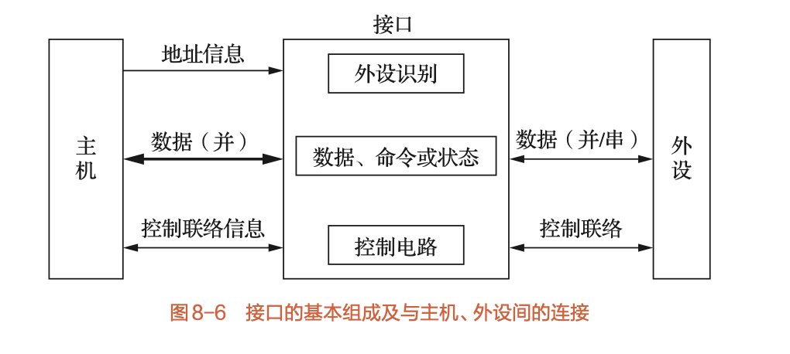

# 8.3 主机与外设的连接 (Host-Peripheral Connection)

> **核心入门章节**：理解为什么要引入"接口"这个概念，以及"接口"与"端口"的区别，还有最重要的端口编址方式。

---

## 1. 为什么需要接口？(The "Why")

### 根本原因

*   **速度不匹配**：
    *   主机（CPU/内存）是高速设备
    *   外设（磁盘、打印机、键盘）通常是低速设备

### 解决办法

*   在主机和外设之间插入**接口 (Interface)**，作为缓冲和转换的中介

---

## 2. 接口的功能 (Functions of Interface)

接口需要完成以下5个功能（需理解记忆）：

### 2.1 数据缓冲

*   通过数据缓冲寄存器（Data Buffer），解决速度差异，防止数据丢失

### 2.2 格式转换

*   串行$\leftrightarrow$并行转换（如外设是串行的，CPU总线是并行的）

### 2.3 地址译码与设备选择

*   识别CPU发来的地址码，选中指定的外设

### 2.4 通信联络控制

*   处理握手信号（如"准备就绪"、"忙"、"应答"），解决时间配合问题

### 2.5 传送命令与状态

*   传递CPU的启动命令，反馈外设的当前状态（就绪/错误）

---

## 3. 接口的组成与端口 (Interface vs. Port)

> **老师重点强调的概念区分**：
> *   **接口 (Interface)**：指整个电路板或芯片，包含逻辑电路和寄存器
> *   **端口 (Port)**：指接口中**可以被CPU直接访问（读/写）的寄存器**

### 三类端口（均通过**数据总线**传送）

#### 3.1 数据端口

*   存放数据（双向，读/写）

#### 3.2 命令/控制端口

*   存放CPU发来的控制命令（**只写**，CPU → 外设）

#### 3.3 状态端口

*   存放外设的状态信息（**只读**，外设 → CPU）

**注意**：有时命令端口和状态端口共用同一个地址，通过CPU的读/写控制线来区分（写是命令，读是状态）

---

## 4. I/O端口的编址方式 (Addressing Modes) —— **高频考点**

CPU如何找到外设？主要有两种方式：

| 特性 | **独立编址 (I/O Mapped)** | **统一编址 (Memory Mapped)** |
| :--- | :--- | :--- |
| **定义** | I/O地址空间与主存地址空间**相互独立**，分开编址 | I/O端口作为主存地址空间的一部分，**不区分**内存和外设 |
| **指令系统** | 需要**专用I/O指令**（如Intel的 `IN`, `OUT`） | 不需要专用指令，使用**访存指令**（如 `MOV`, `LOAD`） |
| **地址空间** | 内存地址空间大，I/O地址空间小 | 占用了一部分内存地址空间 |
| **优点** | 程序清晰，I/O操作容易识别；不占用内存空间 | 指令丰富灵活（可对端口进行各种运算）；控制信号少 |
| **缺点** | 指令功能弱（通常只支持传送）；控制逻辑复杂 | 占用内存空间；程序不易区分是访存还是I/O |
| **典型例子** | **Intel 80x86** | ARM架构、MIPS架构 |

### 4.1 独立编址 (I/O Mapped I/O)

*   **特点**：
    *   I/O地址空间独立于内存地址空间
    *   需要专门的I/O指令（如 `IN AL, 60H`、`OUT 61H, AL`）
    *   需要专门的I/O控制信号（如 `IOR`、`IOW`）

### 4.2 统一编址 (Memory Mapped I/O)

*   **特点**：
    *   I/O端口占用内存地址空间的一部分
    *   使用普通访存指令即可访问I/O端口
    *   不需要专门的I/O控制信号

---

## 💡 学习要点

### 重点总结（复习必背）

1.  **接口的作用**：主要是解决CPU与外设的**速度不匹配**问题
2.  **端口分类**：数据、状态、控制
3.  **编址区别**：
    *   看到 `IN / OUT` 指令 → **独立编址**
    *   看到 `MOV` 指令操作外设 → **统一编址**

### 考试重点

*   **必背**：两种编址方式的对比表格
*   **理解**：接口的五大功能、端口与接口的区别
*   **应用**：能够根据指令类型判断编址方式，或根据编址方式选择合适的指令

### 易混淆点

*   **接口 vs 端口**：
    *   接口是整体（电路板/芯片）
    *   端口是接口中的寄存器（可被CPU访问的部分）
*   **独立编址 vs 统一编址**：
    *   独立编址：需要专用指令，地址空间独立
    *   统一编址：使用访存指令，地址空间统一

