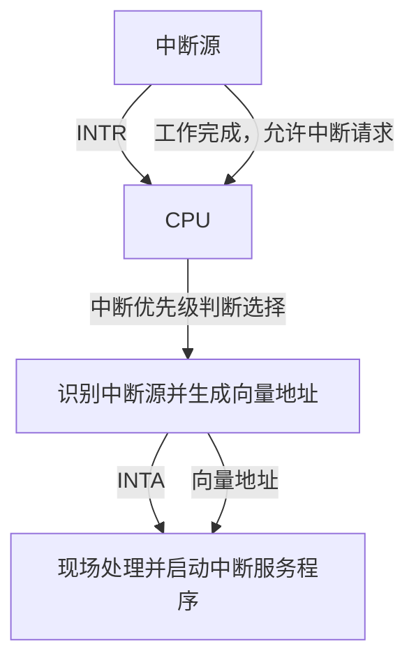
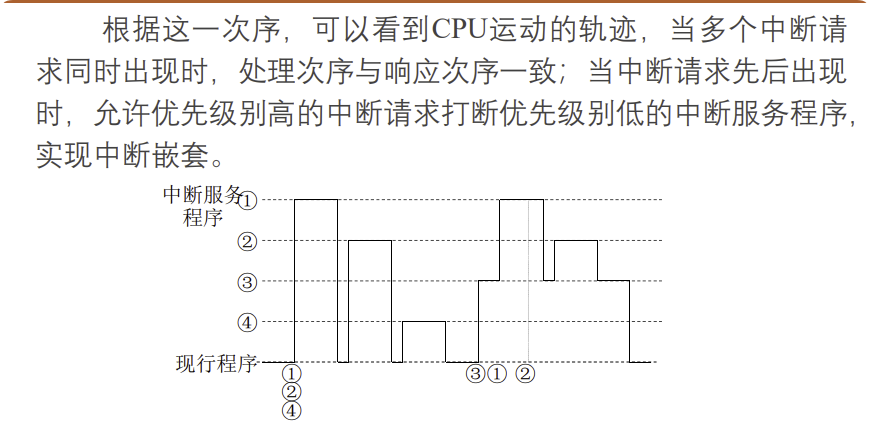

# 8.5 中断系统 (Interrupt System)

> **本章逻辑最复杂、细节考点最多的部分**
> **老师特别强调**：现在的计算机中，中断系统不仅仅是为了I/O，更重要的是处理**异常**（如故障、掉电）。

这一节的核心考点集中在：**中断响应的流程（特别是隐指令）、多重中断（中断嵌套）以及中断屏蔽（如何动态改变优先级）。**

### 中断全过程的五个阶段

中断全过程分为五个阶段：

1.  **中断请求**：中断源发出中断请求信号
2.  **中断判优**：当多个中断源同时请求时，确定响应顺序
3.  **中断响应**：CPU响应中断，执行中断隐指令（硬件自动完成）
4.  **中断处理**：执行中断服务程序（软件完成）
5.  **中断返回**：恢复现场，返回原程序继续执行

---

## 1. 中断请求与判优 (Request & Arbitration)

### 1.1 中断源

*   **定义**：引起中断的事件（如打印机就绪、除数为0、掉电）
*   **中断请求标记触发器 (INTR)**：每个中断源都有一个，为"1"表示有请求

### 1.2 中断判优

*   **问题**：当多个中断源同时请求时，谁先响应？
*   **硬件判优**（常用）：
    *   排队器（链式或独立请求），速度快
    *   **优先级固定**（无法通过软件修改）
*   **软件判优**：
    *   查询程序，速度慢
    *   但优先级可改

### 1.3 优先级原则（一般规律）

*   硬件故障 > 软件中断
*   非屏蔽中断 > 可屏蔽中断
*   DMA > I/O中断
*   高速设备 > 低速设备

### 1.4 触发器与寄存器的对应关系（老师特别强调）

*   **从触发器到寄存器**：每个中断源都有独立的“请求触发器”和“屏蔽触发器”，实际硬件会把这些触发器并到一起形成**中断请求寄存器**与**中断屏蔽寄存器**。
*   **意义**：这解释了为何软件可以一次写入一个 8/16 位“屏蔽字”就同时控制所有中断源的开关。

---

## 2. 中断响应 (Interrupt Response) —— **核心流程**

### 2.1 响应条件（三个条件缺一不可）

1.  有中断请求信号
2.  CPU处于**开中断**状态（EINT/IF = 1）
3.  **一条指令执行完毕**（这是程序中断与DMA最大的不同）

### 2.2 中断隐指令 (Interrupt Implicit Instruction) —— **必考概念**

*   **定义**：CPU响应中断后，由**硬件自动完成**的一系列操作。它不是指令系统中的真正指令，程序员不能调用
*   **功能**（三大步，**必须掌握**）：
    1.  **关中断**：将允许中断触发器置0（EINT=0），防止新的中断打断当前的保护现场操作
    2.  **保护PC（断点）**：将PC（程序计数器）的内容保存到主存（通常存入0号单元或堆栈）
    3.  **寻找中断服务程序入口**：将向量地址送入PC，为进入中断服务程序作准备

> **老师强调**：不要死记硬背 `0→MAR`、`(PC)→MDR` 这种微操作指令，而是要**理解中断周期（即中断隐指令）由硬件自动完成了三件事**：关中断、保护PC（断点）、寻找中断服务程序入口（向量地址送PC）。

#### 2.2.1 中断周期的微操作流程（了解即可）

> **说明**：以下微操作步骤是为了帮助理解中断隐指令的硬件实现过程，**不需要死记硬背**。

中断隐指令在**中断周期**中通过以下微操作完成（硬件自动执行）：

1.  **0 → MAR**（或 **SP → MAR**）：将地址送至存储器地址寄存器
    *   如果断点存入固定地址（如0号单元），则 0 → MAR
    *   如果断点存入堆栈，则 SP → MAR（堆栈指针送MAR）
2.  **(PC) → MDR**：将PC的内容（断点）送至MDR
3.  **Write**：向主存发写命令，启动存储器做写操作
4.  **MDR → M(MAR)**：将MDR的内容通过数据总线写入到MAR所指示的主存单元
5.  **向量地址 → PC**：向量地址形成部件的输出送至PC
6.  **0 → EINT**：关中断，将中断允许触发器清0

**理解要点**：这些微操作最终实现了三大功能：关中断、保护PC、向量地址送PC。

---

### 2.4 中断处理流程示意图（Mermaid）



---

## 3. 中断向量 (Interrupt Vector)

### 3.1 向量中断

*   **定义**：硬件直接产生一个向量地址（Vector Address），指向**中断向量表**
*   **区别**：
    *   **向量地址**：中断向量表在内存中的位置（指针）
    *   **入口地址**：中断服务程序实际的第一条指令地址
*   **流程**：CPU拿到向量地址 → 查表 → 拿到入口地址 → 开始执行

### 3.1.1 中断向量表（Interrupt Vector Table, IVT）

*   **概念**：存放“各中断源的入口地址”的表格，每个表项就是“入口地址/指针”。CPU 根据中断源/类型号找到对应表项，取出入口地址并跳转。
*   **表项内容**：表项可直接存入口地址（直接型），也可存一段跳转指令或指向入口的指针（间接/跳转型）。
*   **构成方式**：硬件固定一片地址空间给 IVT，或由操作系统在启动时初始化表项（如 x86 实模式低端 1KB；现代 OS 在内核态维护 IDT）。
*   **流程对照**：中断源编号 →（硬件形成向量地址）→ 访问 IVT 表项 → 取得入口地址 → 送 PC。
*   **示例**：键盘中断、定时器中断、网络中断各占一个表项，CPU 依据中断类型号定位表项，直接跳转到对应服务程序。
*   **一一对应关系**：每个中断源（编号/类型号）都对应唯一的中断服务程序入口地址；发生中断时，CPU查 IVT，按编号取入口跳转执行。

### 3.2 向量地址的两种形式

*   **形式 A（直接型）**：向量地址本身就是中断服务程序入口（常见于简单系统）。
*   **形式 B（间接/跳转型）**：向量地址只是指向“中断向量表”的指针，再由表项给出真正入口（主流做法，如 21H、13H）。

---

## 4. 中断处理过程 (Processing)

中断处理就是执行中断服务程序。一个完整的中断服务程序由三个部分组成（**软件完成**）：

### 4.1 第一部分：准备部分

**基本功能**：

1.  **保护现场**：
    *   使用 `PUSH` 指令，将**通用寄存器**（ACC, R0等）和状态寄存器（PSW）的内容压栈
    *   **注意**：PC由隐指令保存，寄存器由软件保存

2.  **确定中断源**（仅针对**非向量中断方式**）：
    *   在向量中断方式中，硬件已通过向量地址确定了中断源
    *   在非向量中断方式中，需要通过软件查询中断请求寄存器来确定具体是哪个中断源

3.  **开放中断**：
    *   执行开中断指令，允许更高优先级的中断请求打断当前的低级中断服务程序
    *   这是实现多重中断（中断嵌套）的关键步骤

### 4.2 第二部分：处理部分

*   真正执行为某个中断源服务的中断服务程序
*   执行具体的功能（如读取数据、处理错误、设备控制等）

### 4.3 第三部分：结尾部分

**执行顺序**（**顺序不能乱**）：

1.  **关中断**：
    *   首先关中断，防止在恢复现场过程中被新的中断打断
    *   确保现场恢复操作的原子性

2.  **恢复现场**：
    *   使用 `POP` 指令，依次恢复各寄存器和PSW
    *   恢复的顺序应与保护现场时的顺序相反（栈的LIFO特性）

3.  **开放中断并返回**：
    *   执行中断返回指令（IRET），同时完成：
        *   开放中断，以便返回原来的程序后可响应其它的中断请求
        *   将PC从堆栈弹出，返回到原程序的断点继续执行

**原因**：顺序错了会在现场恢复过程中再被打断，或忘记最后开中断导致后续无法嵌套。

---

## 5. 中断返回 (Interrupt Return)

中断返回是中断全过程的最后一个阶段，在中断服务程序的结尾部分完成：

*   **功能**：恢复被中断程序的现场，返回到原程序的断点继续执行
*   **实现**：通过中断返回指令（IRET）完成，该指令会：
    1.   将PC从堆栈弹出，恢复到中断发生时的值（断点）
    2.   恢复程序状态字（PSW）
    3.   开放中断（如果之前关闭了）
*   **注意**：中断返回后，CPU回到开中断状态，可以响应新的中断请求

---

## 6. 多重中断与中断屏蔽 (Multi-level Interrupts & Masking) —— **计算/分析题重点**

### 6.1 单重中断 vs 多重中断

*   **单重**：处理中断时，不响应新的中断（"一根筋"）
*   **多重（嵌套）**：处理低优先级中断时，允许高优先级中断打断（"插队"）

### 6.2 实现多重中断的条件

*   中断服务程序中必须**提前开中断**（在准备部分，保护现场之后）
*   优先级高的中断源必须能屏蔽优先级低的中断源

### 6.3 中断屏蔽技术 (Interrupt Masking)

*   **屏蔽触发器/屏蔽字 (Mask Word)**：每一位对应一个中断源，1表示屏蔽（不理你），0表示开放
*   **重要结论（考研/期末必考逻辑）**：
    *   **响应优先级**：由硬件排队电路决定，**是固定的**，不能变
    *   **处理优先级**：可以通过设置**屏蔽字**来改变，**是可变的**
*   **例子**：虽然A的响应优先级比B高，但我可以在A的中断服务程序中屏蔽A、开放B；在B的服务程序中屏蔽A、B。这样实际上B可以打断A，B的处理优先级就变高了

### 6.4 轨迹图中的"阶梯"坑位提示

*   在多重中断轨迹图中，每次从"服务程序1"跳到更高优先级的"服务程序2"时，中间必须经过一次**中断响应周期（隐指令）**，硬件会自动关中断、保护PC。
*   画图时转折点不要直接连过去，要标出这段切换阶梯（隐含的关中断与断点保护），否则容易丢分。



### 6.5 核心专项：中断屏蔽码与处理优先级（必考）

> 目的：用屏蔽字把“硬件响应优先级”调整为目标“处理优先级”。

**两个优先级**
* **响应优先级**：硬件排队器决定，只作用于“同时到达谁先答复”，固定不可改。
* **处理优先级**：由屏蔽字决定，“谁能打断谁”，程序可动态改。

**屏蔽字规则**
* 1 = 屏蔽（不让它打断我），0 = 开放（允许打断）。
* 每级服务程序有自己的屏蔽字；永远自屏蔽：自己位 = 1。
* 万能填法：屏蔽想挡住的（填1），开放想放行的（填0）。

**经典例题（响应优先级 1>2>3>4，目标处理优先级 1>4>3>2）**
* 1 级：谁都不能打断 → 屏蔽字 1 1 1 1
* 4 级：仅 1 能打断 → 屏蔽字 0 1 1 1（位序 1 2 3 4）
* 3 级：1、4 能打断 → 屏蔽字 0 1 1 0
* 2 级：人人可打断 → 屏蔽字 0 1 0 0

| 屏蔽字名称 | 源1 | 源2 | 源3 | 源4 | 说明 |
| :--- | :--- | :--- | :--- | :--- | :--- |
| 第1级屏蔽字 | **1** | 1 | 1 | 1 | 谁都不能打断1 |
| 第2级屏蔽字 | 0 | **1** | 0 | 0 | 1,3,4都能打断2 |
| 第3级屏蔽字 | 0 | 1 | **1** | 0 | 只有1,4能打断3 |
| 第4级屏蔽字 | 0 | 1 | 1 | **1** | 只有1能打断4 |

**轨迹图提示**
* 曲线向上跳代表“被更高处理优先级打断”，只有对应位为 0 才能跳；位为 1 就不能跳，必须等当前结束。

---

## 7. 中断 vs 异常 (Interrupt vs. Exception)

### 7.1 内中断 (Exception/Trap)

*   **来源**：CPU内部（如非法操作码、除以0、地址越界）
*   **特点**：不可屏蔽，通常导致程序终止或跳转

### 7.2 外中断 (Interrupt)

*   **来源**：CPU外部（如键盘输入、定时器到期）
*   **特点**：与当前指令无关，随机发生

---

## 💡 学习要点

### 老师授课补充（关于考试）

*   **考题预测**：给出一组中断源（A, B, C, D），给出它们的硬件优先级，然后要求你设置**屏蔽字**，使得它们的处理顺序发生变化（例如变为 A → C → D → B）。这是最经典的题目
*   **做题技巧**：
    *   **屏蔽字设置口诀**：
        1.  **自己屏蔽自己**：对应位必为1。
        2.  **高屏蔽低**：比自己优先级低的，位设1（不让它打断我）。
        3.  **低开放高**：比自己优先级高的，位设0（允许它插队我）。
        4.  **特殊要求**：若题目指定处理顺序（如 A 后立刻 C），就按目标顺序重新决定谁能打断谁，再填位。

### 中断处理流程总结

```
中断发生
  ↓
【阶段1】中断请求：中断源发出请求信号
  ↓
【阶段2】中断判优：确定响应顺序
  ↓
【阶段3】中断响应（硬件：隐指令）
  ├─ 关中断
  ├─ 保存断点（PC）
  └─ 引出中断服务程序（向量地址送PC）
  ↓
【阶段4】中断处理（软件：中断服务程序）
  ├─ 准备部分
  │   ├─ 保护现场（寄存器）
  │   ├─ 确定中断源（非向量中断方式）
  │   └─ 开放中断（允许嵌套）
  ├─ 处理部分
  │   └─ 执行服务程序
  └─ 结尾部分
      ├─ 关中断
      ├─ 恢复现场（寄存器）
      └─ 开放中断
  ↓
【阶段5】中断返回（IRET）
  ├─ 弹出PC（恢复断点）
  └─ 返回原程序继续执行
```

### 考试重点

*   **必背**：中断隐指令的三大功能、中断处理流程
*   **理解**：响应优先级 vs 处理优先级的区别
*   **应用**：能够根据题目要求设置屏蔽字，改变处理优先级

### 易混淆点

*   **隐指令 vs 软件指令**：
    *   隐指令：硬件自动完成，保存PC
    *   软件指令：程序员编写，保存寄存器
*   **响应优先级 vs 处理优先级**：
    *   响应优先级：硬件决定，固定
    *   处理优先级：可通过屏蔽字改变，可变


