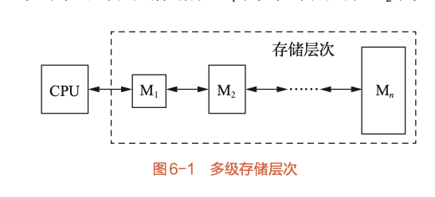
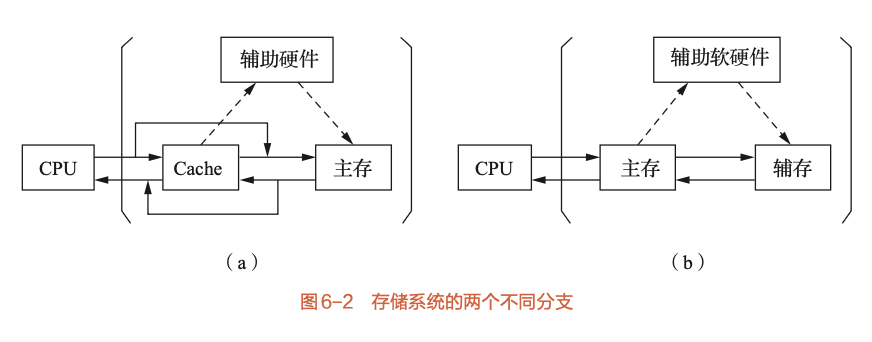
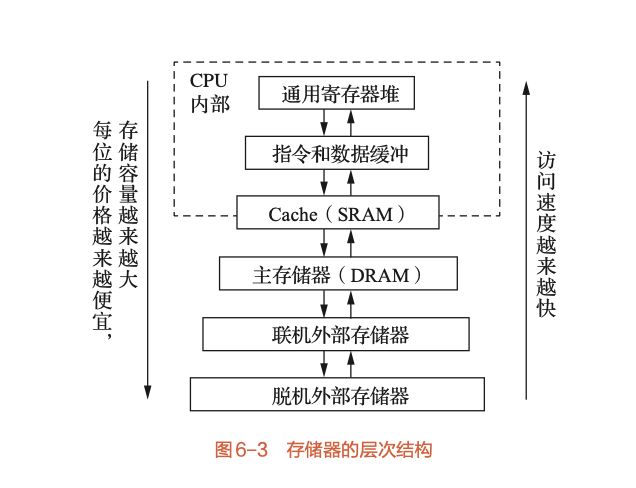
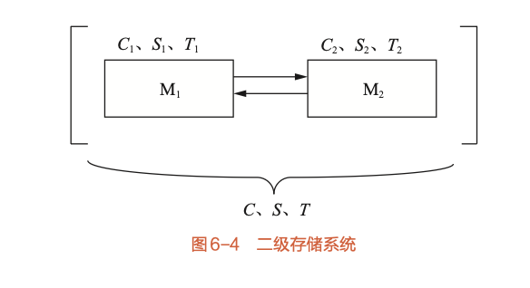

# 6.1 存储系统的组成（详细笔记）

**核心定义**：存储系统是由几个容量、速度和价格各不相同的存储器，通过软硬件结合构成的系统。

## 6.1.1 存储器分类与存储系统定义

### 1. 存储器分类
*   **地位演变**：早期冯·诺依曼结构以运算器为中心，现代计算机以**存储器**为中心（存放指令、操作数、结果）。
*   **容量计算公式**：$S_M = W \times l \times m$
    *   $W$：存储体字长（位/字节）
    *   $l$：每个存储体的字数
    *   $m$：并行工作的存储体个数
*   **分类方式**：
    1.  **按用途**：主存、Cache、通用寄存器、缓冲存储器、磁盘、光盘等。
    2.  **按材料工艺**：ECL、TTL、MOS、磁表面、激光、SRAM、DRAM等。
    3.  **按访问方式**：
        *   随机访问（主存）
        *   块传送（硬盘）
        *   其他：直接译码、先进先出、相联访问。
*   **性能指标**（三个主要指标）：
    1.  **容量**：B, KB, MB, GB。
    2.  **价格**：元/bit。
    3.  **速度**：
        *   **存取时间 ($T_a$)**。
        *   **存取周期 ($T_m$)**。
        *   **频宽/带宽 ($B_m$)**：每秒传送的信息位数/字节数。
            *   单体最大频宽：$B_m = W / T_m$
            *   $m$个并行最大频宽：$B_m = W \times m / T_m$

### 2. 存储系统定义与目标
*   **矛盾**：系统要求高速度、大容量、低价格，但单一存储器无法同时满足（速度越快价格越高容量越小）。
*   **解决方法**：**多级存储层次**。
    *   利用 $M_1$（快、小、贵）到 $M_n$（慢、大、廉）的组合。
    *   **目标**：使整体系统具有接近 $M_1$ 的**速度**，接近 $M_n$ 的**容量**，接近 $M_n$ 的**低廉价格**。
*   **访存原则**：由近到远（CPU $\to M_1 \to M_2 \to \dots$）。

### 3. 存储系统的两个主要分支
在微机中，通常形成三级存储系统（Cache - 主存 - 辅存），分为两个层次：

| 层次 | **Cache - 主存层次** | **主存 - 辅存层次 (虚拟存储系统)** |
| :--- | :--- | :--- |
| **主要目的** | 提高**速度**（弥补主存速度不足） | 扩大**容量**（弥补主存容量不足） |
| **构成** | Cache + 主存 | 主存 + 磁盘（辅存） |
| **实现方式** | 全部由**硬件**实现 | **软硬件结合**（操作系统管理） |
| **透明性** | 对系统和应用程序员**均透明** | 对系统程序员不透明，对应用程序员透明 |
| **CPU视角** | 速度近Cache，容量为主存，价格近主存 | 速度近主存，容量为虚拟空间，价格近辅存 |

---

## 6.1.2 存储系统的层次结构

**金字塔结构**（从上至下）：
1.  通用寄存器堆
2.  指令和数据缓冲
3.  **Cache (SRAM)**
4.  **主存储器 (DRAM)**
5.  联机外部存储器 (硬盘)
6.  脱机外部存储器 (磁带、光盘)

**规律**（越往下）：
*   访问速度越慢 ($T_i < T_{i+1}$)
*   存储容量越大 ($S_i < S_{i+1}$)
*   单位价格越便宜 ($C_i > C_{i+1}$)

---

## 6.1.3 存储系统的性能参数

以二级存储系统（$M_1$ 为高速小容量，$M_2$ 为低速大容量）为例。

### 1. 关键参数定义
*   **容量 ($S$)**：$S = S_2$（即等于最大存储器的容量）。
    *   注意：容量不是两者之和，而是系统能提供的逻辑地址空间。
*   **价格 ($C$)**：每位平均价格。
    *   公式：$C = \frac{C_1 \times S_1 + C_2 \times S_2}{S_1 + S_2}$
    *   当 $S_2 \gg S_1$ 时，$C \approx C_2$（价格接近最便宜的）。
*   **命中率 ($H$)**：CPU访问的信息在 $M_1$ 中找到的概率。
    *   $H = \frac{R_1}{R_1 + R_2}$ ($R_1$为命中次数，$R_2$为未命中次数)。
    *   不命中率/失效率 = $1 - H$。

### 2. 等效访问时间 ($T_A$)
取决于 $M_1$ 和 $M_2$ 的启动方式：
1.  **同时启动**：
    *   $T_A = H \times T_1 + (1 - H) \times T_2$
2.  **串行启动**（$M_1$ 不命中才启动 $M_2$）：
    *   $T_A = H \times T_1 + (1 - H) \times (T_1 + T_2) = T_1 + (1 - H) \times T_2$

### 3. 访问效率 ($e$)
*   定义：$e = \frac{T_1}{T_A}$ （$T_1$ 为最快存储器的访问时间）。
*   设速度比 $r = T_2 / T_1$，则：
    *   $e = \frac{1}{H + (1 - H) r}$ （假设同时启动模型简化推导）
*   **结论**：效率 $e$ 与命中率 $H$ 和速度比 $r$ 有关。
    *   $H$ 越高，$e$ 越接近 1。
    *   $r$ 越大（速度差距越大），$H$ 必须极高才能维持较高的效率。

### 4. 预取技术对命中率的影响
*   **背景**：在虚拟存储系统中，$M_1$（主存）和 $M_2$（磁盘）速度差巨大（$r$ 可达 $10^5$），必须依靠极高的命中率。
*   **方法**：利用**程序局部性原理**，未命中时将相邻数据块一起调入 $M_1$。
*   **新命中率公式**：
    *   设 $n$ 为数据块大小（或数据重复使用次数），原命中率为 $H$，采用预取后的命中率 $H'$ 为：
    *   $H' = 1 - \frac{1 - H}{n}$
    *   或者表达为：$H' = \frac{H + n - 1}{n}$ (基于访问次数放大的推导)。
    *   *结论*：块越大（$n$越大），命中率越高。
*   **关键例题结论（例6-6）**：如果要求访问效率 $e \ge 0.9$，而在速度差 $T_2 = 10^5 T_1$ 的极端情况下，需要极高的数据重复利用率。计算表明数据块在主存中的重复利用率至少需达到 **44次** 才能满足效率要求。

---

## 典型计算题型总结

::: tip 基于书中例题
1.  **计算命中率**：已知访问总次数和失效次数，求 $H$。
2.  **计算等效时间**：已知 $H, T_1, T_2$，根据启动策略求 $T_A$。
3.  **计算效率**：$e = T_1 / T_A$。
4.  **反向求解**：已知要求的效率 $e$ 和速度比 $r$，求所需的最低命中率 $H$。
5.  **预取效果**：已知块大小 $n$，求提升后的命中率 $H'$。
:::
