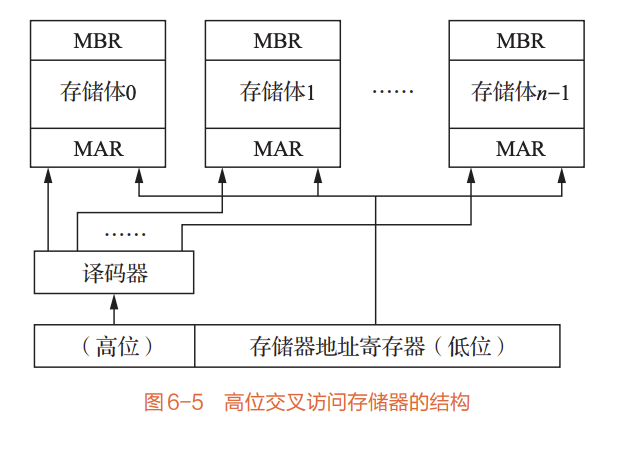
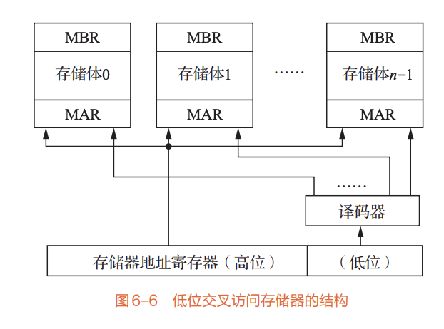

# 6.2 并行存储系统（详细笔记）

**核心定义**：并行存储系统是为解决CPU与主存之间的速度匹配问题而设计的存储架构，核心思路是通过"并行访问"在一个存取周期内读出多个字，依靠整体信息吞吐率的提升弥补单体存储器的速度不足。

## 6.2.1 核心背景与设计目标

*   **问题**：常规主存为"单体单字存储器"，仅包含一个存储体，一次只能访问一个存储字，其频宽（单位时间内传输的数据量）难以匹配高速CPU的需求。
*   **设计目标**：在不显著增加成本的前提下，通过并行/重叠技术提升主存频宽，使主存速度更贴近CPU的运算速度。

---

## 6.2.2 并行存储系统的分类

根据存储体数量、字长及访问方式的不同，并行存储系统主要分为三类，核心差异体现在"并行维度"（多存储体并行/多字长并行）：

### 1. 单体多字存储器

*   **设计思路**：仅使用一个存储体，但将其字长扩大m倍（与CPU字长匹配），使得一个主存周期内可并行读出m个CPU字。
*   **频宽计算**：最大频宽 $B_M = \frac{m \times W}{T_M}$（W为原存储体字长，$T_M$ 为存储周期）。
*   **优点**：结构简单，仅需扩展存储体字长。
*   **缺点**：
    *   需要位数足够多的寄存器（存储并行读出的多个字）
    *   多次访问总线会增加总线开销
    *   仅适用于连续地址访问，对非连续地址（如转移指令）效率低

### 2. 多体单字交叉存储器

*   **设计思路**：由m个容量较小、字长与CPU字长相等的存储体组成，每个存储体独立具备地址译码、读写驱动电路，多个存储体并行工作，一次访问多个存储体的单个字。
*   **频宽计算**：最大频宽 $B_M = \frac{m \times W}{T_M}$（m为存储体个数，W为单个存储体字长）。
*   **编址方式**：为减少访问冲突，采用"模m交叉编址"，分为两种：
    *   **高位交叉**：用地址码高位区分存储体号，核心目的是**扩大存储容量**（多个存储体拼接成大容量存储器）。
    *   **低位交叉**：用地址码低位区分存储体号，核心目的是**提升访问速度**（连续地址分散到不同存储体，可并行访问，适合流水处理）。
*   **优点**：实际频宽高于单体多字方式，且总价格与器件数量和单体多字方式接近；支持不同存储体并行访问。
*   **缺点**：访问冲突概率较高，主要包括取指冲突、读操作数冲突、写数据冲突、读写冲突（多个访问请求同时指向同一存储体）。

### 3. 多体多字存储器

*   **设计思路**：结合"多体单字"（多存储体并行）和"单体多字"（多字长并行）的优势，既设置多个存储体，又将每个存储体的字长扩展，进一步提升频宽。
*   **适用场景**：高端计算机系统，对频宽要求极高的场景（如大型数据处理、高性能计算）。

---

## 6.2.3 关键技术：交叉访问与冲突优化

### 1. 交叉访问的核心逻辑

以"低位交叉编址"为例（最常用的高速访问方案）：

*   **地址分配**：将连续的CPU字地址分散到不同存储体，例如8个存储体时，地址0→存储体0、地址1→存储体1、…、地址7→存储体7、地址8→存储体0（模8交叉）。
*   **访问时序**：多个存储体分时使用总线，同时给出多个地址，并行访问不同存储体，实现"流水线式"数据传输，大幅提升连续地址访问的效率。

### 2. 访问冲突问题

多体单字存储器的主要瓶颈是"访问冲突"——当多个访问请求指向同一存储体时，需排队等待。

*   **冲突来源**：
    *   取指与读操作数冲突（CPU同时需要取指令和读数据，指向同一存储体）
    *   写数据与读数据冲突（CPU写数据和读数据指向同一存储体）
*   **优化方向**：合理设计存储体个数（m需匹配CPU访问频率）、采用低位交叉编址、优化指令调度减少非连续地址访问。

---

## 6.2.4 双端口存储器 (Dual-Port RAM)

双端口存储器是并行存储系统的一种特殊形式，核心特点是"双独立端口"，专门解决多设备并行访问主存的需求。

### 1. 结构特点

*   同一个存储体配备两组相互独立的读写控制电路，拥有两个独立端口（左端口、右端口），每个端口都有专属的地址线、数据线和控制线。
*   两个端口可独立对存储器中任意位置的数据进行存取操作，共享存储体资源。

### 2. 冲突处理

当两个端口同时访问同一存储单元时，会发生数据冲突（写冲突/读冲突），需通过硬件仲裁解决：

*   **冲突场景**：
    1.  同时写同一单元（写冲突）
    2.  一个写、一个读同一单元（读写冲突）
    3.  同时读同一单元（无冲突）
    4.  访问不同单元（无冲突）
*   **仲裁机制**：每个端口设置"$\overline{BUSY}$"忙信号，当两个端口访问同一单元时，先发出请求的端口 $\overline{BUSY}$=H（允许访问），后发出请求的端口 $\overline{BUSY}$=L（禁止访问），确保数据一致性。
*   **注意事项**：两个端口的存取请求信号需相差5ns以上，否则仲裁逻辑无法判定优先级，避免双端口同时访问导致错误。

### 3. 适用场景

适用于多设备共享主存的场景，例如CPU与I/O处理机（IOP）同时访问主存，无需等待对方释放总线，提升系统并行处理能力。

---

## 三类并行存储系统对比

| 类型 | 核心优势 | 核心劣势 | 适用场景 |
| :--- | :--- | :--- | :--- |
| 单体多字存储器 | 结构简单、成本低 | 总线开销大、非连续访问效率低 | 连续地址访问（如数组遍历） |
| 多体单字交叉存储器 | 频宽提升显著、成本可控 | 存在访问冲突 | 通用场景（指令/数据混合访问） |
| 多体多字存储器 | 频宽最高 | 结构复杂、成本高 | 高性能计算（大规模并行数据处理） |

---

## 核心总结

::: tip 要点回顾
并行存储系统的核心是"并行化"——通过多存储体并行工作（多体）或多字长并行读取（多字）提升频宽，解决CPU与主存的速度匹配问题。其中：

*   **多体单字交叉存储器（低位交叉编址）** 是最常用的方案，兼顾频宽与成本；
*   **双端口存储器** 是特殊的并行存储形式，专注于解决多设备共享主存的冲突问题；
*   **并行存储系统的局限**：提升频宽的能力有限（m越多，总线负载越重，延时增加），且对非连续地址访问（如转移指令）效率下降，需与后续Cache、虚拟存储系统配合使用。
:::
