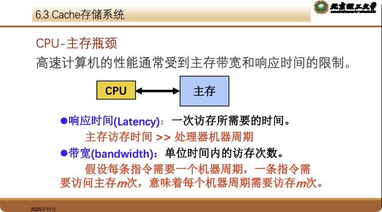
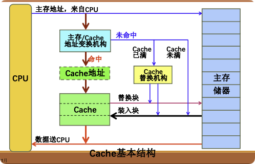

# 6.3 Cache存储系统（详细笔记）

**核心逻辑**：利用程序执行的**局部性原理**，在CPU和主存之间插入一个小容量、高速度的SRAM（Cache），以解决CPU与主存之间的速度匹配问题。

## 6.3.1 程序局部性原理 (Principle of Locality)

Cache能有效工作的基础是程序运行时的局部性：

### 1. 时间局部性 (Temporal Locality)

*   **含义**：如果一个信息项正在被访问，那么在近期它很可能再次被访问。
*   **原因**：程序中的**循环**结构、子程序调用等。
*   **策略**：将刚访问过的信息保留在Cache中。

### 2. 空间局部性 (Spatial Locality)

*   **含义**：如果一个信息项正在被访问，那么与它地址相邻的信息近期也可能被访问。
*   **原因**：指令的**顺序执行**、数组/向量的连续存放。
*   **策略**：将当前访问信息与其相邻信息（整块）一起调入Cache。

---

## 6.3.2 Cache基本原理与结构

### 1. 基本定义

*   **构成**：由高速的**SRAM**组成，直接制作在CPU芯片内。
*   **透明性**：对**所有程序员**（应用及系统）均透明，由纯硬件管理。
*   **单位**：Cache和主存都被划分为大小相等的**块 (Block)**（或称行 Line）。
*   **数据交换**：
    *   **CPU与Cache**：以**字 (Word)** 为单位传送。
    *   **Cache与主存**：以**块 (Block)** 为单位传送。

### 2. 基本运作流程

1.  CPU发出主存地址。
2.  **地址变换**：判断该地址所在的数据块是否在Cache中。
    *   **命中 (Hit)**：直接从Cache读/写数据（快速）。
    *   **未命中/失效 (Miss)**：
        *   访问主存读取数据送给CPU。
        *   同时将包含该数据的**整块**从主存调入Cache（预取）。
        *   若Cache已满，需执行**替换算法**。

---

## 6.3.3 地址映像和变换（核心考点）

如何定义主存块与Cache块之间的对应关系？主要有三种方式。

### 1. 全相联映像 (Fully Associative)

*   **规则**：主存中的任意一块可以装入Cache中的**任意**一个位置。
*   **地址结构**：只有 `Tag (标记)` 和 `块内地址`。
*   **优点**：
    *   冲突概率最低（只有Cache全满时才冲突）。
    *   空间利用率最高。
*   **缺点**：
    *   比较电路最复杂（需将主存Tag与Cache中**所有**行的Tag同时比较）。
    *   成本高，通常只用于小容量Cache或TLB。

### 2. 直接映像 (Direct Mapping)

*   **规则**：主存中的每一块只能装入Cache中**唯一指定**的位置。
    *   公式：`Cache行号 = 主存块号 MOD Cache行数`
*   **地址结构**：`Tag (区号)` | `Index (Cache行号)` | `Offset (块内地址)`
*   **优点**：
    *   硬件实现最简单，无需昂贵的相联比较器。
    *   地址变换速度快。
*   **缺点**：
    *   **冲突概率最高**。即使Cache有空位，只要对应的特定行被占，就必须替换，容易导致"抖动"。

### 3. 组相联映像 (Set Associative) —— 最常用的折衷方案

*   **规则**：将Cache分为 $G$ 个组，每组包含 $S$ 个块（称为 **S路组相联**）。
    *   **组间**：直接映像（主存块必须去特定的组）。
    *   **组内**：全相联（主存块可以放在该组内的任意位置）。
    *   公式：`Cache组号 = 主存块号 MOD Cache组数`
*   **地址结构**：`Tag (标记)` | `Set Index (组号)` | `Offset (块内地址)`
*   **特例关系**：
    *   当 $S=1$ 时（每组1块）：变为**直接映像**。
    *   当 $S=$ Cache总块数时（只有1组）：变为**全相联**。
*   **性能**：$S$ 越大，冲突越少，但硬件越复杂。

| 特性         | 直接映像 | 全相联             | 组相联 |
| :----------- | :------- | :----------------- | :----- |
| **灵活性**   | 最差     | 最好               | 居中   |
| **冲突率**   | 最高     | 最低               | 居中   |
| **硬件代价** | 最低     | 最高               | 居中   |
| **速度**     | 最快     | 较慢（比较逻辑多） | 较快   |

---

## 6.3.4 Cache替换算法

当Cache（或某一组）已满，新块需要调入时，需要决定替换哪一块。

### 1. 常见算法

1.  **随机法 (RAND)**：简单，但命中率低，未利用局部性。

2.  **先进先出 (FIFO)**：
    *   替换最早调入的块。
    *   **缺点**：可能替换掉经常使用的重要块（如循环体内的代码）。容易产生**颠簸 (Thrashing)** 现象。
    *   **注意**：FIFO**不是**堆栈型算法（增加Cache容量可能导致命中率反而下降，即Belady异常）。

3.  **近期最少使用 (LFU)**：
    *   替换访问次数最少的块。
    *   缺点：实现复杂（需大计数器），对由于历史原因频发但当前不再使用的块处理不好。

4.  **近期最久未使用 (LRU, Least Recently Used)** —— **最常用/性能较好**
    *   **原理**：基于"过去"预测"未来"。替换掉最长时间没有被访问过的块。
    *   **优点**：较好地利用了程序局部性，命中率接近OPT。
    *   **性质**：属于**堆栈型算法**（Cache容量增加，命中率单调上升）。
    *   **硬件实现**：
        *   计数器法
        *   寄存器栈法
        *   比较对法（矩阵法）：使用触发器矩阵记录两两块的访问先后顺序

5.  **优化替换 (OPT)**：
    *   替换**未来**最长时间内不会被用到的块。
    *   **地位**：理想化算法，无法实现（因为无法预知未来），仅作为评价其他算法优劣的标准。

### 2. 颠簸 (Thrashing)

*   **定义**：刚被替换出去的块立刻又要被使用，导致频繁的调入调出，效率急剧下降。
*   **原因**：Cache容量太小或替换算法不佳（如FIFO在特定序列下）。

---

## 6.3.5 Cache写策略（一致性问题）

当CPU修改了Cache中的内容，如何保证主存内容的一致性？

### 1. 写直达法 (Write-Through)

*   **操作**：CPU写命中时，同时写入Cache和主存。
*   **优点**：
    *   实现简单，主存始终保持最新数据，一致性好。
    *   可靠性高。
*   **缺点**：
    *   速度慢（受限于主存写速度）。
    *   总线通信量大。
*   **写失效策略**：通常配合 **不按写分配 (No-write allocate)**，即直接写主存，不将块调入Cache。

### 2. 写回法 (Write-Back) / 抵触修改法

*   **操作**：CPU只写入Cache，不立即写主存。只有当该Cache块**被替换**出去时，才写回主存。
*   **标志位**：每个Cache行需要一个 **修改位/脏位 (Dirty Bit)**。
    *   Dirty=1：该块被修改过，替换时需写回主存。
    *   Dirty=0：该块未被修改，替换时直接覆盖（无需写回）。
*   **优点**：
    *   速度快（减少主存写次数）。
    *   降低总线流量（例如对同一变量多次修改只写回一次）。
*   **缺点**：
    *   控制复杂，存在数据不一致风险。
*   **写失效策略**：通常配合 **按写分配 (Write allocate)**，即先把块调入Cache，再在Cache中修改。

### 3. 写缓冲 (Write Buffer)

*   为了减少CPU等待写主存的时间，在Cache和主存之间设置一个小容量缓冲，用于暂存待写入主存的数据。

---

---

## 6.3.6 核心例题

本章涉及的核心例题包括：

- **例6-1**：基础命中率计算
- **例6-2**：综合性能计算（命中率、等效访问时间、访问效率）
- **例6-3**：速度比与效率的关系
- **例6-4**：虚拟存储器的极端情况
- **例6-5**：预取对命中率的影响
- **例6-6**：反求重复利用率
- **例6-7**：组相联映射计算
- **例6-8**：替换算法模拟（FIFO和LRU）

详细解题过程请参考：[核心例题详解](../核心例题详解.md)
